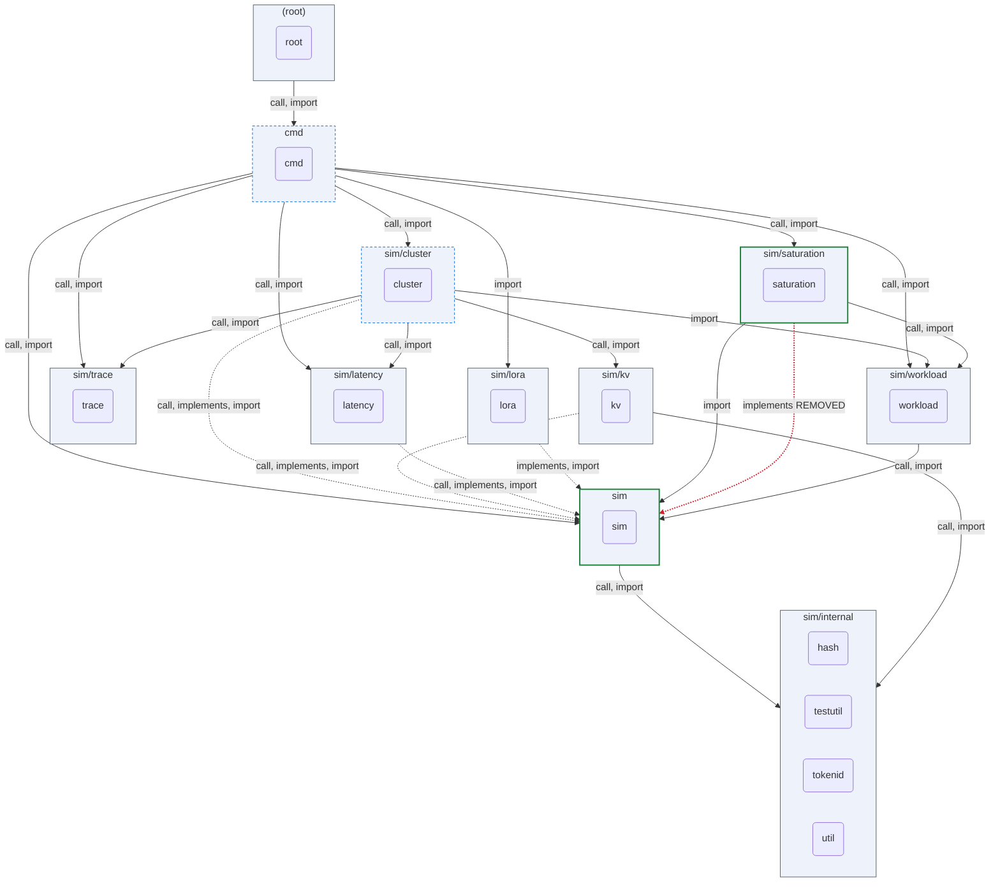
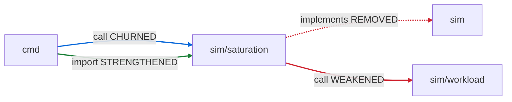
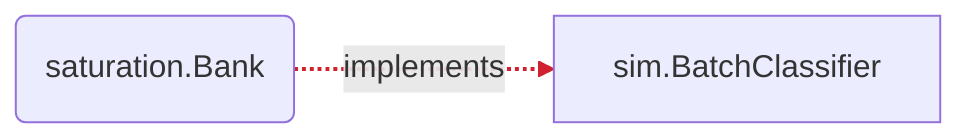

## ARCHON PR review — `70e9ba8` → `5e28e00b`

_Deterministic · no LLM · package-altitude architecture._

**Verdict: `ARCHITECTURAL_CHANGE`**

Architectural change — a package boundary moved; an architecture review is required.

1 edge− · 2 surface · 1 schema · 4 invariant · 1 contract

### Component view

_Nodes: green = boundary moved · blue-dashed = surface/schema/invariant only · grey = unchanged. Edges: green = added · red-dashed = removed · grey = unchanged. ⟲ = dependency cycle._



### Witness delta — full vs partial decoupling

**1 edge(s) fully decoupled; 1 edge(s) PARTIALLY decoupled (weakened)**

_Red dashed = connection fully removed · red solid = weakened (still coupled) · green = added/strengthened · blue = churned._



| Edge | Kind | Status | Removed | Still coupled via |
|---|---|---|---|---|
| `sim/saturation → sim` | implements | **REMOVED** (full decoupling) | `Bank \|= BatchClassifier` | — |
| `sim/saturation → sim/workload` | call | **WEAKENED** (partial) | `NewBacklogClassifier` | `DefaultBacklogDriftConfig`, `NewBacklogDriftConfig` |
| `cmd → sim/saturation` | call | CHURNED | `Bank.Classify` | `AllDetectorNames`, `Bank.Close`, `BuildDetector`, `LoadSaturationConfig` _(+5 more symbol)_ |
| `cmd → sim/saturation` | import | STRENGTHENED | — | — |

### Interface-contract delta

_Green = implementer added · red dashed = implementer removed._



| Interface | + implementers | − implementers | uncovered (evidence gap) | contract test |
|---|---|---|---|---|
| `sim.BatchClassifier` | — | saturation.Bank | — | — |

### Invariants touched (guarded promises)

| Package | + added | ~ modified | − removed | promise on |
|---|---|---|---|---|
| `cmd` | TestResolveSaturation_FinalWindowErrors, TestResolveSaturation_FinalWindowResolutionOrder, TestSaturationStdout_FinalLabelShape, TestSaturationTracer_RunNoReportStillReturnsFinal | TestResolveSaturation_ConfigOrReportWithoutDetectors, TestSaturationTracer_AllEqualsExplicitList, TestSaturationTracer_BankWritesAllDetectors, TestSaturationTracer_DecoupledFromGlobals, TestSaturationTracer_SingleWritesTrace, TestSaturationTracer_SubsetMatchesRecordsUnderAll, TestSaturationTracer_ZeroRequestsWritesEmptyTrace, TestSaveResults_MetricsPrintedToStdout | TestSaturationBC8_StdoutByteIdenticalWithoutAndWithDetectors, TestSaturationTracer_TraceNoOpWhenNoReport | — |
| `sim` | — | TestBuildOutput_AdapterEventCountsSurface, TestBuildOutput_AdapterKeysSorted, TestBuildOutput_NoAdapters_OmitsBlock, TestBuildOutput_PerAdapterMetrics, TestColdLoadGate_INV8_NoDeadlockUnderCapacityPressure, TestColdLoadGate_LoadsSerializePerInstance, TestColdLoadGate_SameAdapterCoalesces, TestColdLoadGate_WarmIncursNoLoadLatency, TestNewSimulator_AdaptersWithoutCapacity, TestResidentAdapterSet_ActiveRun_Deterministic, TestResidentAdapterSet_CapacityBoundAcrossRun, TestResidentAdapterSet_InertWhenNoLoRA, TestResidentAdapterSet_MixedBaseAndAdapterTraffic, TestResidentAdapterSet_PreemptionDoesNotDoubleCountLoad, TestSaveResults_AlwaysEmitsHeader_ZeroCompletions, TestSaveResults_ConservationFields, TestSaveResults_DroppedUnservable_InJSON, TestSaveResults_IncludesIncompleteRequests, TestSaveResults_InstanceID_Default, TestSaveResults_InstanceID_Empty, TestSaveResults_InstanceID_InJSON, TestSaveResults_LengthCappedRequests_InJSON, TestSaveResults_NoWallClockFields, TestSaveResults_PerRequestITL_InMilliseconds, TestSaveResults_ZeroRuntime_NoInfinity, TestSimulator_Determinism_ByteIdenticalJSON | — | sim.ResidentAdapterSet |
| `cluster` | — | TestInstanceSimulator_EvictRequest_ReleasesAdapterPin | — | sim.Event |
| `saturation` | TestBank_RunActuallyReplaysEvents, TestBank_RunProducesNonEmptyTrace, TestReduceAll_EmptyInputEmptyMap, TestReduceAll_GroupsByDetector, TestReduceAll_PerGroupWindowing, TestReduceAll_SingleDetectorStillMap, TestReduceOne_Contracts, TestReduceOne_ExactWindowBoundaryInclusive, TestWriteCombinedReport_FinalBlock | TestBank_AllEqualsExplicitList, TestBank_Deterministic, TestBank_SubsetMatchesRecordsUnderAll, TestBank_ZeroRequestsEmptyTrace, TestE2E_ExtractorParity_ByteIdenticalTrace, TestE2E_ReplayComposite_WritesTrace, TestE2E_ReplayEmptyInput_WritesEmptyTrace, TestMetricsOutput_SaturationField, TestWriteCombinedReport_ByteIdentical, TestWriteCombinedReport_EmptyInput_WritesEmptyTrace | TestBank_ClassifyActuallyReplaysEvents, TestBank_SatisfiesBatchClassifierContract | sim.BatchClassifier, saturation.Detector, saturation.TraceSink |

### Schema (wire/DB data contract) changes

| Package | + fields | − fields |
|---|---|---|
| `saturation` | `CombinedReport.Final` | — |

### Public surface changes

| Package | + added | − removed |
|---|---|---|
| `sim` | — | `BatchClassifier` |
| `saturation` | `ReduceAll`, `ReduceOne`, `Bank.Run` | `NewBacklogDriftDetectorWithClassifier`, `Bank.Classify` |

<details>
<summary><code>review.json</code></summary>

```json
{
  "schema": "archon.pr-review/v1",
  "repo": "/Users/toslali/Desktop/work/ibm/projects/llm-inference/study/inference-llmd/codeboarding/main-repo-blis",
  "base": "70e9ba8",
  "head": "5e28e00b",
  "labelA": "70e9ba8",
  "labelB": "5e28e00b",
  "verdict": "ARCHITECTURAL_CHANGE",
  "summary": "Architectural change — a package boundary moved; an architecture review is required.",
  "emptyAtPackageAltitude": false,
  "counts": {
    "packagesAdded": 0,
    "packagesRemoved": 0,
    "edgesAdded": 0,
    "edgesRemoved": 1,
    "surfaceChanged": 2,
    "schemaChanged": 1,
    "invariants": 4,
    "contracts": 1,
    "violations": 0,
    "witnessesFullyDecoupled": 1,
    "witnessesPartiallyDecoupled": 1
  },
  "invariants": [
    {
      "package": "github.com/inference-sim/inference-sim/cmd",
      "added": [
        "TestResolveSaturation_FinalWindowErrors",
        "TestResolveSaturation_FinalWindowResolutionOrder",
        "TestSaturationStdout_FinalLabelShape",
        "TestSaturationTracer_RunNoReportStillReturnsFinal"
      ],
      "removed": [
        "TestSaturationBC8_StdoutByteIdenticalWithoutAndWithDetectors",
        "TestSaturationTracer_TraceNoOpWhenNoReport"
      ],
      "modified": [
        "TestResolveSaturation_ConfigOrReportWithoutDetectors",
        "TestSaturationTracer_AllEqualsExplicitList",
        "TestSaturationTracer_BankWritesAllDetectors",
        "TestSaturationTracer_DecoupledFromGlobals",
        "TestSaturationTracer_SingleWritesTrace",
        "TestSaturationTracer_SubsetMatchesRecordsUnderAll",
        "TestSaturationTracer_ZeroRequestsWritesEmptyTrace",
        "TestSaveResults_MetricsPrintedToStdout"
      ]
    },
    {
      "package": "github.com/inference-sim/inference-sim/sim",
      "modified": [
        "TestBuildOutput_AdapterEventCountsSurface",
        "TestBuildOutput_AdapterKeysSorted",
        "TestBuildOutput_NoAdapters_OmitsBlock",
        "TestBuildOutput_PerAdapterMetrics",
        "TestColdLoadGate_INV8_NoDeadlockUnderCapacityPressure",
        "TestColdLoadGate_LoadsSerializePerInstance",
        "TestColdLoadGate_SameAdapterCoalesces",
        "TestColdLoadGate_WarmIncursNoLoadLatency",
        "TestNewSimulator_AdaptersWithoutCapacity",
        "TestResidentAdapterSet_ActiveRun_Deterministic",
        "TestResidentAdapterSet_CapacityBoundAcrossRun",
        "TestResidentAdapterSet_InertWhenNoLoRA",
        "TestResidentAdapterSet_MixedBaseAndAdapterTraffic",
        "TestResidentAdapterSet_PreemptionDoesNotDoubleCountLoad",
        "TestSaveResults_AlwaysEmitsHeader_ZeroCompletions",
        "TestSaveResults_ConservationFields",
        "TestSaveResults_DroppedUnservable_InJSON",
        "TestSaveResults_IncludesIncompleteRequests",
        "TestSaveResults_InstanceID_Default",
        "TestSaveResults_InstanceID_Empty",
        "TestSaveResults_InstanceID_InJSON",
        "TestSaveResults_LengthCappedRequests_InJSON",
        "TestSaveResults_NoWallClockFields",
        "TestSaveResults_PerRequestITL_InMilliseconds",
        "TestSaveResults_ZeroRuntime_NoInfinity",
        "TestSimulator_Determinism_ByteIdenticalJSON"
      ],
      "guardedContracts": [
        "github.com/inference-sim/inference-sim/sim.ResidentAdapterSet"
      ]
    },
    {
      "package": "github.com/inference-sim/inference-sim/sim/cluster",
      "modified": [
        "TestInstanceSimulator_EvictRequest_ReleasesAdapterPin"
      ],
      "guardedContracts": [
        "github.com/inference-sim/inference-sim/sim.Event"
      ]
    },
    {
      "package": "github.com/inference-sim/inference-sim/sim/saturation",
      "added": [
        "TestBank_RunActuallyReplaysEvents",
        "TestBank_RunProducesNonEmptyTrace",
        "TestReduceAll_EmptyInputEmptyMap",
        "TestReduceAll_GroupsByDetector",
        "TestReduceAll_PerGroupWindowing",
        "TestReduceAll_SingleDetectorStillMap",
        "TestReduceOne_Contracts",
        "TestReduceOne_ExactWindowBoundaryInclusive",
        "TestWriteCombinedReport_FinalBlock"
      ],
      "removed": [
        "TestBank_ClassifyActuallyReplaysEvents",
        "TestBank_SatisfiesBatchClassifierContract"
      ],
      "modified": [
        "TestBank_AllEqualsExplicitList",
        "TestBank_Deterministic",
        "TestBank_SubsetMatchesRecordsUnderAll",
        "TestBank_ZeroRequestsEmptyTrace",
        "TestE2E_ExtractorParity_ByteIdenticalTrace",
        "TestE2E_ReplayComposite_WritesTrace",
        "TestE2E_ReplayEmptyInput_WritesEmptyTrace",
        "TestMetricsOutput_SaturationField",
        "TestWriteCombinedReport_ByteIdentical",
        "TestWriteCombinedReport_EmptyInput_WritesEmptyTrace"
      ],
      "guardedContracts": [
        "github.com/inference-sim/inference-sim/sim.BatchClassifier",
        "github.com/inference-sim/inference-sim/sim/saturation.Detector",
        "github.com/inference-sim/inference-sim/sim/saturation.TraceSink"
      ]
    }
  ],
  "schemaChanges": [
    {
      "package": "github.com/inference-sim/inference-sim/sim/saturation",
      "added": [
        {
          "kind": "field",
          "name": "CombinedReport.Final",
          "sig": "map[string]Level"
        }
      ]
    }
  ],
  "surface": [
    {
      "package": "github.com/inference-sim/inference-sim/sim",
      "removed": [
        {
          "kind": "type",
          "name": "BatchClassifier"
        }
      ]
    },
    {
      "package": "github.com/inference-sim/inference-sim/sim/saturation",
      "added": [
        {
          "kind": "func",
          "name": "ReduceAll",
          "sig": "func(records []TraceRecord, windowUs int64) map[string]Level"
        },
        {
          "kind": "func",
          "name": "ReduceOne",
          "sig": "func(records []TraceRecord, windowUs int64) Level"
        },
        {
          "kind": "method",
          "name": "Bank.Run",
          "sig": "func(requests []github.com/inference-sim/inference-sim/sim.RequestMetrics) error"
        }
      ],
      "removed": [
        {
          "kind": "func",
          "name": "NewBacklogDriftDetectorWithClassifier",
          "sig": "func(classifier github.com/inference-sim/inference-sim/sim/workload.BacklogClassifier) Detector"
        },
        {
          "kind": "method",
          "name": "Bank.Classify",
          "sig": "func(requests []github.com/inference-sim/inference-sim/sim.RequestMetrics, _ int) interface{}"
        }
      ]
    }
  ],
  "contracts": [
    {
      "interface": "github.com/inference-sim/inference-sim/sim.BatchClassifier",
      "implementersRemoved": [
        "github.com/inference-sim/inference-sim/sim/saturation.Bank"
      ]
    }
  ],
  "components": {
    "module": "github.com/inference-sim/inference-sim",
    "depth": 2,
    "components": [
      {
        "name": "(root)",
        "members": [
          ""
        ],
        "inCycle": false
      },
      {
        "name": "cmd",
        "members": [
          "cmd"
        ],
        "inCycle": false,
        "change": "minor"
      },
      {
        "name": "sim",
        "members": [
          "sim"
        ],
        "inCycle": false,
        "change": "boundary"
      },
      {
        "name": "sim/cluster",
        "members": [
          "sim/cluster"
        ],
        "inCycle": false,
        "change": "minor"
      },
      {
        "name": "sim/internal",
        "members": [
          "sim/internal/hash",
          "sim/internal/testutil",
          "sim/internal/tokenid",
          "sim/internal/util"
        ],
        "inCycle": false
      },
      {
        "name": "sim/kv",
        "members": [
          "sim/kv"
        ],
        "inCycle": false
      },
      {
        "name": "sim/latency",
        "members": [
          "sim/latency"
        ],
        "inCycle": false
      },
      {
        "name": "sim/lora",
        "members": [
          "sim/lora"
        ],
        "inCycle": false
      },
      {
        "name": "sim/saturation",
        "members": [
          "sim/saturation"
        ],
        "inCycle": false,
        "change": "boundary"
      },
      {
        "name": "sim/trace",
        "members": [
          "sim/trace"
        ],
        "inCycle": false
      },
      {
        "name": "sim/workload",
        "members": [
          "sim/workload"
        ],
        "inCycle": false
      }
    ],
    "edges": [
      {
        "from": "(root)",
        "to": "cmd",
        "kind": "call, import",
        "change": ""
      },
      {
        "from": "cmd",
        "to": "sim",
        "kind": "call, import",
        "change": ""
      },
      {
        "from": "cmd",
        "to": "sim/cluster",
        "kind": "call, import",
        "change": ""
      },
      {
        "from": "cmd",
        "to": "sim/latency",
        "kind": "call, import",
        "change": ""
      },
      {
        "from": "cmd",
        "to": "sim/lora",
        "kind": "import",
        "change": ""
      },
      {
        "from": "cmd",
        "to": "sim/saturation",
        "kind": "call, import",
        "change": ""
      },
      {
        "from": "cmd",
        "to": "sim/trace",
        "kind": "call, import",
        "change": ""
      },
      {
        "from": "cmd",
        "to": "sim/workload",
        "kind": "call, import",
        "change": ""
      },
      {
        "from": "sim",
        "to": "sim/internal",
        "kind": "call, import",
        "change": ""
      },
      {
        "from": "sim/cluster",
        "to": "sim",
        "kind": "call, implements, import",
        "change": ""
      },
      {
        "from": "sim/cluster",
        "to": "sim/kv",
        "kind": "call, import",
        "change": ""
      },
      {
        "from": "sim/cluster",
        "to": "sim/latency",
        "kind": "call, import",
        "change": ""
      },
      {
        "from": "sim/cluster",
        "to": "sim/trace",
        "kind": "call, import",
        "change": ""
      },
      {
        "from": "sim/cluster",
        "to": "sim/workload",
        "kind": "import",
        "change": ""
      },
      {
        "from": "sim/kv",
        "to": "sim",
        "kind": "call, implements, import",
        "change": ""
      },
      {
        "from": "sim/kv",
        "to": "sim/internal",
        "kind": "call, import",
        "change": ""
      },
      {
        "from": "sim/latency",
        "to": "sim",
        "kind": "call, implements, import",
        "change": ""
      },
      {
        "from": "sim/lora",
        "to": "sim",
        "kind": "implements, import",
        "change": ""
      },
      {
        "from": "sim/saturation",
        "to": "sim",
        "kind": "import",
        "change": ""
      },
      {
        "from": "sim/saturation",
        "to": "sim/workload",
        "kind": "call, import",
        "change": ""
      },
      {
        "from": "sim/saturation",
        "to": "sim",
        "kind": "implements",
        "change": "removed"
      },
      {
        "from": "sim/workload",
        "to": "sim",
        "kind": "call, import",
        "change": ""
      }
    ]
  },
  "witnesses": [
    {
      "from": "sim/saturation",
      "to": "sim",
      "kind": "implements",
      "status": "REMOVED",
      "removed": [
        "Bank |= BatchClassifier"
      ]
    },
    {
      "from": "sim/saturation",
      "to": "sim/workload",
      "kind": "call",
      "status": "WEAKENED",
      "removed": [
        "NewBacklogClassifier"
      ],
      "remaining": [
        "DefaultBacklogDriftConfig",
        "NewBacklogDriftConfig"
      ]
    },
    {
      "from": "cmd",
      "to": "sim/saturation",
      "kind": "call",
      "status": "CHURNED",
      "removed": [
        "Bank.Classify"
      ],
      "added": [
        "Bank.Run",
        "InMemoryCollector.Records",
        "ReduceAll"
      ],
      "remaining": [
        "AllDetectorNames",
        "Bank.Close",
        "BuildDetector",
        "LoadSaturationConfig",
        "NewBank",
        "NewInMemoryCollector",
        "ReplayOneDetector",
        "ValidateReportPath",
        "WriteCombinedReport"
      ]
    },
    {
      "from": "cmd",
      "to": "sim/saturation",
      "kind": "import",
      "status": "STRENGTHENED",
      "added": [
        "observe_cmd.go"
      ],
      "remaining": [
        "saturation.go"
      ]
    }
  ]
}
```

</details>

