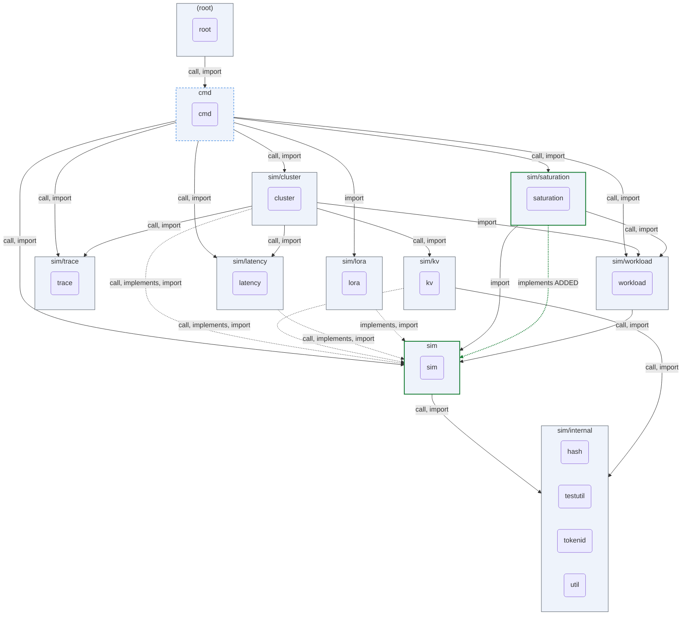
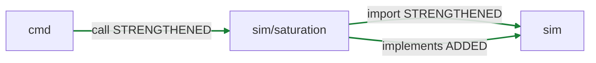
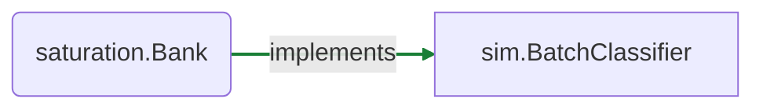

## ARCHON PR review — `18c2c9260cdf5af7007ffd39103c5304ecd805ac` → `pr-1524`

_Deterministic · no LLM · package-altitude architecture._

**Verdict: `ARCHITECTURAL_CHANGE`**

Architectural change — a package boundary moved; an architecture review is required.

2 edge+ · 1 surface · 2 invariant · 1 contract

### Component view

_Nodes: green = boundary moved · blue-dashed = surface/schema/invariant only · grey = unchanged. Edges: green = added · red-dashed = removed · grey = unchanged. ⟲ = dependency cycle._

### Witness delta — full vs partial decoupling

_Red dashed = connection fully removed · red solid = weakened (still coupled) · green = added/strengthened · blue = churned._

| Edge | Kind | Status | Removed | Still coupled via |
|---|---|---|---|---|
| `cmd → sim/saturation` | call | STRENGTHENED | — | — |
| `sim/saturation → sim` | import | STRENGTHENED | — | — |
| `sim/saturation → sim` | implements | ADDED | — | — |

### Interface-contract delta

_Green = implementer added · red dashed = implementer removed._

| Interface | + implementers | − implementers | uncovered (evidence gap) | contract test |
|---|---|---|---|---|
| `sim.BatchClassifier` | saturation.Bank | — | — | `TestBank_SatisfiesBatchClassifierContract` |

### Invariants touched (guarded promises)

| Package | + added | ~ modified | − removed | promise on |
|---|---|---|---|---|
| `cmd` | TestResolveSaturation_AllMixedWithNames, TestResolveSaturation_AllUsesBank, TestResolveSaturation_BankSelectedBlockAccepted, TestResolveSaturation_BankTrailingCommaEnforcesOwnership, TestResolveSaturation_BankUnselectedBlockErrors, TestResolveSaturation_EmptySelection, TestResolveSaturation_SingleDetectorBlockOwnership, TestResolveSaturation_SubsetListUsesBank, TestResolveSaturation_UnknownNameInList, TestSaturationBC8_StdoutByteIdenticalWithoutAndWithDetectors, TestSaturationTracer_AllEqualsExplicitList, TestSaturationTracer_BankWritesAllDetectors, TestSaturationTracer_DecoupledFromGlobals, TestSaturationTracer_SingleWritesTrace, TestSaturationTracer_SubsetMatchesRecordsUnderAll, TestSaturationTracer_TraceNoOpWhenNoReport, TestSaturationTracer_ZeroRequestsWritesEmptyTrace | TestResolveSaturation_ConfigOrReportWithoutDetectors, TestResolveSaturation_Off, TestResolveSaturation_UnknownName, TestResolveSaturation_UnwritableReportPath, TestResolveSaturation_ValidSingleDetector | TestResolveSaturation_BankRejected, TestResolveSaturation_CompositeWithEmptyConfig, TestRunSaturationTrace_NoOpWhenOff, TestRunSaturationTrace_WritesTrace | saturation.Detector |
| `saturation` | TestBank_AllEqualsExplicitList, TestBank_ClassifyActuallyReplaysEvents, TestBank_Deterministic, TestBank_SatisfiesBatchClassifierContract, TestBank_SubsetMatchesRecordsUnderAll, TestBank_ZeroRequestsEmptyTrace, TestNewBank_AllAcceptsEveryBlock, TestNewBank_CanonicalOrderAndDedup, TestNewBank_EmptySelectionErrors, TestNewBank_SelectedBlockAccepted, TestNewBank_SelectedBlockValueErrorSurfaces, TestNewBank_UnknownNameErrors, TestNewBank_UnselectedBlockErrors | — | — | — |

### Public surface changes

| Package | + added | − removed |
|---|---|---|
| `saturation` | `AllDetectorNames`, `NewBank`, `Bank.Classify`, `Bank.Close`, `Bank` | — |

