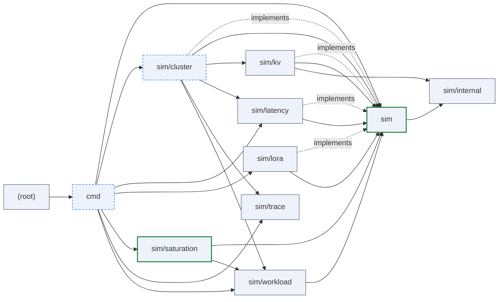
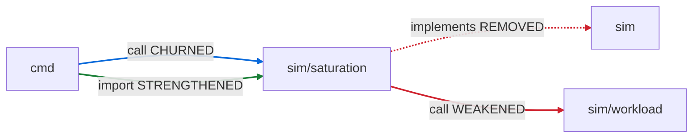
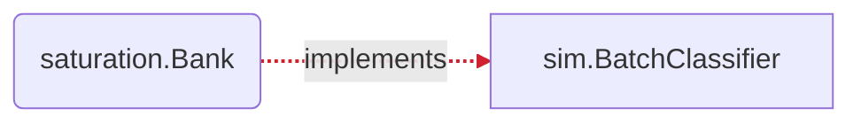

## ARCHON PR review — `70e9ba855ecdf00e08c40984a17c1934b5aa8d77` → `pr-1546`

_Deterministic · no LLM · package-altitude architecture._

**Verdict: `ARCHITECTURAL_CHANGE`**

Architectural change — a package boundary moved; an architecture review is required.

1 edge− · 2 surface · 1 schema · 4 invariant · 1 contract

### Component view

_Green = boundary moved · blue-dashed = surface/schema/invariant only · grey = unchanged. ⟲ marks a dependency cycle._

### Witness delta — full vs partial decoupling

**1 edge(s) fully decoupled; 1 edge(s) PARTIALLY decoupled (weakened)**

_Red dashed = connection fully removed · red solid = weakened (still coupled) · green = added/strengthened · blue = churned._

| Edge | Kind | Status | Removed | Still coupled via |
|---|---|---|---|---|
| `sim/saturation → sim` | implements | **REMOVED** (full decoupling) | `Bank \|= BatchClassifier` | — |
| `sim/saturation → sim/workload` | call | **WEAKENED** (partial) | `NewBacklogClassifier` | `DefaultBacklogDriftConfig`, `NewBacklogDriftConfig` |
| `cmd → sim/saturation` | call | CHURNED | `Bank.Classify` | `AllDetectorNames`, `Bank.Close`, `BuildDetector`, `LoadSaturationConfig` _(+5 more symbol)_ |
| `cmd → sim/saturation` | import | STRENGTHENED | — | — |

### Interface-contract delta

_Green = implementer added · red dashed = implementer removed._

| Interface | + implementers | − implementers | uncovered (evidence gap) | contract test |
|---|---|---|---|---|
| `sim.BatchClassifier` | — | saturation.Bank | — | — |

### Invariants touched (guarded promises)

| Package | + added | ~ modified | − removed | promise on |
|---|---|---|---|---|
| `cmd` | TestResolveSaturation_FinalWindowErrors, TestResolveSaturation_FinalWindowResolutionOrder, TestSaturationStdout_FinalLabelShape, TestSaturationTracer_RunNoReportStillReturnsFinal | TestResolveSaturation_ConfigOrReportWithoutDetectors, TestSaturationTracer_AllEqualsExplicitList, TestSaturationTracer_BankWritesAllDetectors, TestSaturationTracer_DecoupledFromGlobals, TestSaturationTracer_SingleWritesTrace, TestSaturationTracer_SubsetMatchesRecordsUnderAll, TestSaturationTracer_ZeroRequestsWritesEmptyTrace, TestSaveResults_MetricsPrintedToStdout | TestSaturationBC8_StdoutByteIdenticalWithoutAndWithDetectors, TestSaturationTracer_TraceNoOpWhenNoReport | — |
| `sim` | — | TestBuildOutput_AdapterEventCountsSurface, TestBuildOutput_AdapterKeysSorted, TestBuildOutput_NoAdapters_OmitsBlock, TestBuildOutput_PerAdapterMetrics, TestColdLoadGate_INV8_NoDeadlockUnderCapacityPressure, TestColdLoadGate_LoadsSerializePerInstance, TestColdLoadGate_SameAdapterCoalesces, TestColdLoadGate_WarmIncursNoLoadLatency, TestNewSimulator_AdaptersWithoutCapacity, TestResidentAdapterSet_ActiveRun_Deterministic, TestResidentAdapterSet_CapacityBoundAcrossRun, TestResidentAdapterSet_InertWhenNoLoRA, TestResidentAdapterSet_MixedBaseAndAdapterTraffic, TestResidentAdapterSet_PreemptionDoesNotDoubleCountLoad, TestSaveResults_AlwaysEmitsHeader_ZeroCompletions, TestSaveResults_ConservationFields, TestSaveResults_DroppedUnservable_InJSON, TestSaveResults_IncludesIncompleteRequests, TestSaveResults_InstanceID_Default, TestSaveResults_InstanceID_Empty, TestSaveResults_InstanceID_InJSON, TestSaveResults_LengthCappedRequests_InJSON, TestSaveResults_NoWallClockFields, TestSaveResults_PerRequestITL_InMilliseconds, TestSaveResults_ZeroRuntime_NoInfinity, TestSimulator_Determinism_ByteIdenticalJSON | — | sim.ResidentAdapterSet |
| `cluster` | — | TestInstanceSimulator_EvictRequest_ReleasesAdapterPin | — | sim.Event |
| `saturation` | TestBank_RunActuallyReplaysEvents, TestBank_RunProducesNonEmptyTrace, TestReduceAll_EmptyInputEmptyMap, TestReduceAll_GroupsByDetector, TestReduceAll_PerGroupWindowing, TestReduceAll_SingleDetectorStillMap, TestReduceOne_AllLevelsOutOfRange_DefaultsToStable, TestReduceOne_Contracts, TestReduceOne_ExactWindowBoundaryInclusive, TestWriteCombinedReport_FinalBlock | TestBank_AllEqualsExplicitList, TestBank_Deterministic, TestBank_SubsetMatchesRecordsUnderAll, TestBank_ZeroRequestsEmptyTrace, TestE2E_ExtractorParity_ByteIdenticalTrace, TestE2E_ReplayComposite_WritesTrace, TestE2E_ReplayEmptyInput_WritesEmptyTrace, TestMetricsOutput_SaturationField, TestWriteCombinedReport_ByteIdentical, TestWriteCombinedReport_EmptyInput_WritesEmptyTrace | TestBank_ClassifyActuallyReplaysEvents, TestBank_SatisfiesBatchClassifierContract | sim.BatchClassifier, saturation.Detector, saturation.TraceSink |

### Schema (wire/DB data contract) changes

| Package | + fields | − fields |
|---|---|---|
| `saturation` | `CombinedReport.Final` | — |

### Public surface changes

| Package | + added | − removed |
|---|---|---|
| `sim` | — | `BatchClassifier` |
| `saturation` | `ReduceAll`, `ReduceOne`, `Bank.Run` | `NewBacklogDriftDetectorWithClassifier`, `Bank.Classify` |

