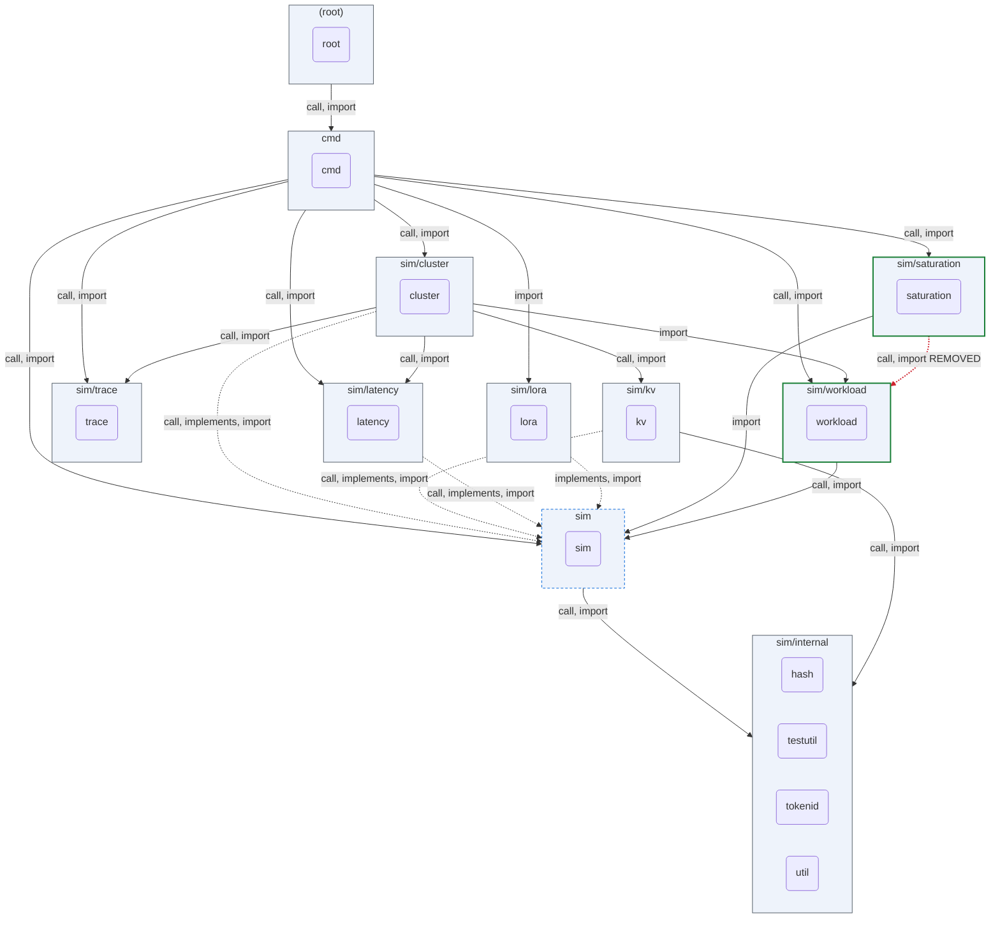
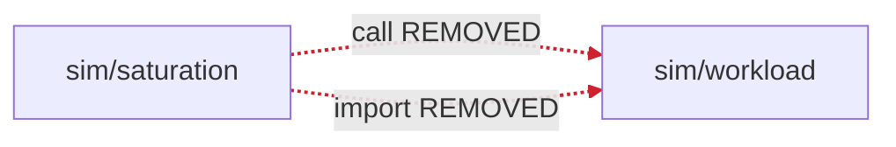

## ARCHON PR review — `d77764f520568b6c67616ca178b214fe288be7fd` → `pr-1567`

_Deterministic · no LLM · package-altitude architecture._

**Verdict: `ARCHITECTURAL_CHANGE`**

Architectural change — a package boundary moved; an architecture review is required.

1 pkg− · 4 edge− · 3 surface · 1 schema · 2 invariant

### Component view

_Nodes: green = boundary moved · blue-dashed = surface/schema/invariant only · grey = unchanged. Edges: green = added · red-dashed = removed · grey = unchanged. ⟲ = dependency cycle._

### Witness delta — full vs partial decoupling

**2 edge(s) fully decoupled; 0 edge(s) PARTIALLY decoupled (weakened)**

_Red dashed = connection fully removed · red solid = weakened (still coupled) · green = added/strengthened · blue = churned._

| Edge | Kind | Status | Removed | Still coupled via |
|---|---|---|---|---|
| `sim/saturation → sim/workload` | call | **REMOVED** (full decoupling) | `DefaultBacklogDriftConfig`, `NewBacklogDriftConfig` | — |
| `sim/saturation → sim/workload` | import | **REMOVED** (full decoupling) | `backlog_drift.go`, `config.go` | — |

### Interface-contract delta

_No interface-contract membership changed._

### Invariants touched (guarded promises)

| Package | + added | ~ modified | − removed | promise on |
|---|---|---|---|---|
| `saturation` | TestBacklogDriftConfig_Validation_CIOutOfRange, TestBacklogDriftConfig_Validation_NaNPeakRatio, TestBacklogDriftConfig_Validation_NegativeMinWindows, TestBacklogDriftConfig_Validation_ValidConfig, TestBacklogDriftConfig_Validation_ZeroWindow | — | — | — |
| `workload` | — | — | TestAnalyzeBacklogDriftWithClassifier_NilClassifier_DefaultsToSlopeBased, TestAnalyzeBacklogDriftWithClassifier_OrchestratorFallback_AllInjectWindows, TestAnalyzeBacklogDrift_AbsoluteTimestamps, TestAnalyzeBacklogDrift_AbsoluteTimestamps_ClassificationPreserved, TestAnalyzeBacklogDrift_AllExcluded, TestAnalyzeBacklogDrift_EndToEnd_PERSISTENTLY_SATURATED, TestAnalyzeBacklogDrift_EndToEnd_UNSATURATED, TestAnalyzeBacklogDrift_InsufficientData, TestBacklogDriftConfig_NewBacklogDriftConfig_DrainRatioParamValidation, TestBacklogDriftConfig_NewBacklogDriftConfig_ValidatesDrainRatioRange, TestBacklogDriftConfig_Validation_CIOutOfRange, TestBacklogDriftConfig_Validation_NaNPeakRatio, TestBacklogDriftConfig_Validation_NegativeMinWindows, TestBacklogDriftConfig_Validation_ValidConfig, TestBacklogDriftConfig_Validation_ZeroWindow, TestClassifyBacklogDrift_PERSISTENTLY_SATURATED, TestClassifyBacklogDrift_TRANSIENT_BACKLOG, TestClassifyBacklogDrift_UNSATURATED, TestComputeWindowMetrics_ActiveCount_AtBoundaries, TestComputeWindowMetrics_Identity_DeltaBacklogEqualsEnterMinusLeft, TestComputeWindowMetrics_UnreasonablyLargeDuration, TestDrainRatioClassifier_AllWarmup_Unsaturated, TestDrainRatioClassifier_InteriorEmptyWindow_RemainsInject, TestDrainRatioClassifier_LastArrivalWindow_TrailingDrainExcluded, TestDrainRatioClassifier_NaNSkipCount_SurfacesInNote, TestDrainRatioClassifier_NoArrivals_Unsaturated, TestDrainRatioClassifier_PersistentlySaturated, TestDrainRatioClassifier_TransientBacklog, TestDrainRatioClassifier_Unsaturated, TestFitSlopeRegression_FlatLine, TestFitSlopeRegression_NegativeSlope, TestFitSlopeRegression_PositiveSlope, TestIsValidBacklogClassifier_RegistryContents, TestNewBacklogClassifier_DefaultIsDrainRatio, TestNewBacklogClassifier_FactoryRegistryAgreement, TestNewBacklogClassifier_PanicsOnUnknown, TestNewBacklogClassifier_SlopeBased, TestProperty_P1_Determinism, TestProperty_P2_MonotonicityExtremes, TestProperty_P3_DrainPhaseInvariance, TestProperty_P4_WarmupRobustness, TestProperty_P5_Conservation, TestProperty_P6_CrossClassifierAgreement, TestReadBacklogDriftReportJSON_InvalidFile, TestRequestsToIntervals_Conservation_QueuedAndRunningBothCounted, TestRequestsToIntervals_Eligibility_ThreeCases, TestRequestsToIntervals_EmptyInput_ReturnsEmpty, TestRequestsToIntervals_StateQueued_IncludedAsHorizonTruncated, TestSaturationClassification_ManualScenarios, TestSaturationProgression_Demonstration, TestSaturationProgression_RealWorkloads, TestSaturationProgression_TransitionBoundaries, TestWriteBacklogDriftReportJSON_RoundTrip, TestWriteBacklogDriftReportJSON_SanitizesNaN | workload.BacklogClassifier |

### Schema (wire/DB data contract) changes

| Package | + fields | − fields |
|---|---|---|
| `workload` | — | `BacklogDriftReport.Classification`, `BacklogDriftReport.FinalBacklog`, `BacklogDriftReport.InitialBacklog`, `BacklogDriftReport.MeanInFlight`, `BacklogDriftReport.Note`, `BacklogDriftReport.PeakInFlight`, `BacklogDriftReport.Recommendation`, `BacklogDriftReport.Slope`, `BacklogDriftReport.SlopeLower`, `BacklogDriftReport.SlopeUpper`, `BacklogDriftReport.Windows` |

### Public surface changes

| Package | + added | − removed |
|---|---|---|
| `sim` | — | `IsValidBacklogClassifier`, `ValidBacklogClassifierNames` |
| `saturation` | `DefaultBacklogDriftConfig`, `NewBacklogDriftConfig`, `BacklogDriftConfig` | — |
| `workload` | — | `AnalyzeBacklogDrift`, `AnalyzeBacklogDriftWithClassifier`, `DefaultBacklogDriftConfig`, `NewBacklogClassifier`, `NewBacklogDriftConfig`, `ReadBacklogDriftReportJSON`, `RequestsToIntervals`, `WriteBacklogDriftReportJSON`, `BacklogClassifier`, `BacklogDriftConfig`, `BacklogDriftReport`, `RequestInterval`, `SlopeStats`, `WindowMetrics` |

