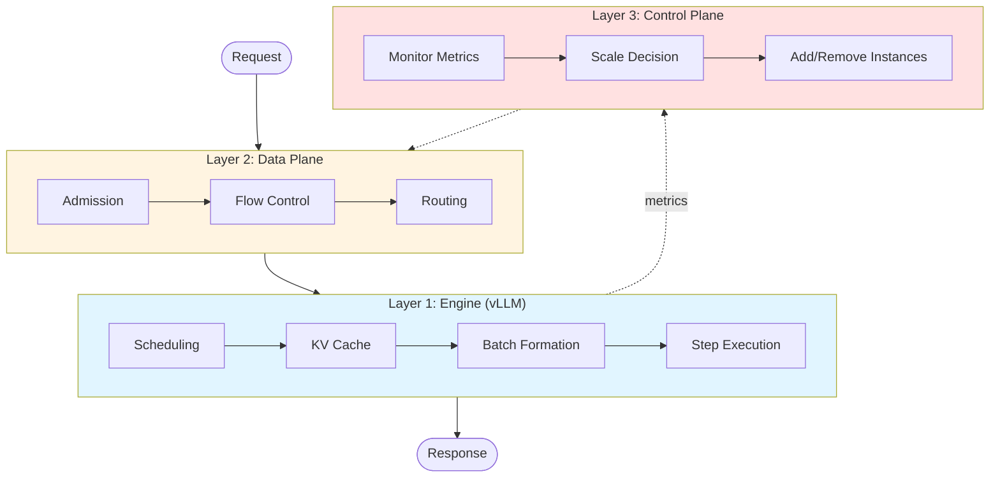

# Building Trust: The Physics of High-Fidelity Inference Simulation

Imagine testing routing policies, autoscaling strategies, and hardware configurations without touching production. No risk. No downtime. Just answers. That's the promise of simulation—but only if it is accurate enough to trust.

A simple queueing model predicts 50ms time-to-first-token. Production measures 200ms. The difference reveals how much complexity hides beneath the surface. Capacity decisions are million-dollar bets—H100 vs A100, tensor parallelism 4 vs 8—and intuition fails at this scale.

<!-- more -->

## The Right Physics, Not Everything

Building a trustworthy simulator is not about modeling everything — it is about modeling the right physics. The batch dynamics that couple request latencies. The KV cache pressure that triggers preemption. The prefill-decode handoffs that trade network costs for throughput. Miss any of these, and your predictions diverge from reality.

BLIS achieves this by modeling the actual physics—the mechanisms that determine latency in real systems: how requests couple through shared batch steps, how KV cache pressure triggers preemption cascades, how prefill-decode disaggregation trades network transfer costs for hardware specialization. The entire simulation runs on CPU—no GPUs required. Step times come from analytical roofline models (compute vs memory bottlenecks derived from model architecture and hardware specs) corrected with coefficients trained on real vLLM production traces. The result: microsecond-scale predictions with single-digit percent accuracy. Fast enough for rapid iteration, accurate enough to trust for production decisions.

This article shows what it takes to build that level of fidelity—from token generation physics to distributed orchestration. Let us follow a request's 50-millisecond journey through the system to see where every millisecond of that complexity lives.

## A Request's Journey: The Hidden Complexity

A user hits enter. Fifty milliseconds later, the first token appears. What happened in between? Three architectural layers working together: the inference engine (vLLM), the data plane (cluster orchestration), and the control plane (autoscaling). Model them all with fidelity, or your capacity decisions will be wrong.

### Layer 1: The Engine (vLLM)

The inference engine running on a single GPU instance is vLLM. It schedules requests, manages memory, and generates tokens. Understanding how it works is critical for accurate prediction—and most people get the fundamental execution model wrong.

vLLM does not process requests individually. It processes batches in steps. One step equals one GPU forward pass. All requests in the batch go through together, and the step time is determined by the slowest operation. Consider four requests in a batch: three generate single output tokens (2ms, memory-bound), while the fourth processes a 512-token prompt (20ms, compute-bound). The step time is 20ms. All four requests wait the full duration, even though three could finish in 2ms if they ran alone.

But ten decode requests do not take "10 × 2ms"—they take one 2ms batch step that covers all ten simultaneously. Get this wrong, and throughput predictions can be 5-10x off.

BLIS replicates the mechanisms that govern this behavior. Priority scheduling ensures critical requests go before batch jobs. Block-level KV cache management handles prefix reuse (massive speedup for RAG workloads) and preemption when memory fills. Continuous batching allows requests to join and leave mid-flight as they complete. All modeled with exact vLLM semantics, not approximations.

For step timing, BLIS computes two bottlenecks without GPU execution: compute time (FLOPs / GPU_TFLOPS) and memory time (bytes / GPU_bandwidth). Step time equals the maximum of the two. For a 512-token prefill on H100, compute dominates at 20ms. For decode reading KV cache, memory dominates at 2ms. BLIS applies learned corrections for kernel overhead and cache effects:

$$
t_{\text{step}} = \sum_{i} \beta_i \cdot \phi_i(\text{batch}, \text{model}, \text{hardware})
$$

where $\phi_i$ are roofline basis functions (compute and memory bottlenecks) and $\beta_i$ are learned coefficients trained on real vLLM traces. The simulator predicts step time using model architecture from HuggingFace and hardware specs from datasheets. This is how the simulation runs on CPU while maintaining accuracy.

Batch composition evolves constantly, and step times evolve with it. A small decode-only batch runs at 2ms per token. A long prompt joins—everyone waits 20ms while it processes. The prompt finishes and switches to decode—back to 2ms. Another request completes and leaves—now 1.8ms with the smaller batch. Request latencies are coupled through batching, not independent.

vLLM operates in batch steps, not individual requests. BLIS simulates this through discrete-event modeling—one step event per batch operation, with membership updating after each completion. This is the foundation for accurate throughput and latency prediction. In production, a single vLLM instance is only part of the system. Clusters of instances add orchestration complexity.

### Layer 2: The Data Plane (Cluster Orchestration)

[To be written - admission, routing, signal staleness, P/D orchestration]

### Layer 3: The Control Plane (Autoscaling)

[To be written - WVA pipeline, feedback delays]

### The Complete Journey

[To be written - integration of all three layers with end-to-end trace]

## BLIS in Action: A Real Scenario

[To be written - PD disaggregation example with real numbers]

## From Modeling to Validation

[To be written - recap + tease validation article]

---

*This is the first article in a series on BLIS's architecture. Next: **Validating Against Ground Truth** - how BLIS achieves single-digit percent error on real workloads.*
