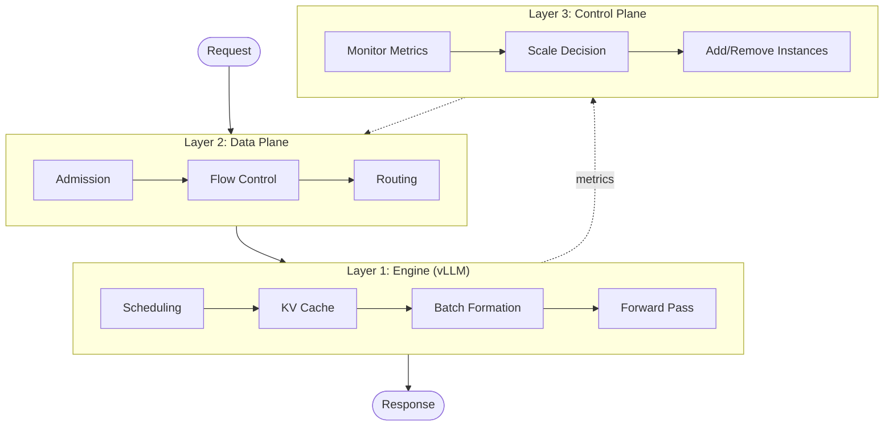
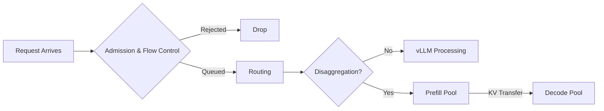

# The Physics of High-Fidelity Inference Simulation

Every capacity decision in LLM inference carries real stakes. Choosing the wrong GPU type or tensor parallelism degree means overspending by millions or underdelivering on latency SLOs, while testing a new routing policy on live traffic risks cascading bugs across the entire fleet.

What does it take to build a simulator accurate enough to guide these decisions? The challenge lies in capturing the right mechanisms. Inference engines process batches in lockstep where all requests wait for the slowest operation, KV cache fills trigger preemptions, and a single long prompt stalls dozens of short decodes. When these couplings are not modeled, predictions diverge from reality - a back-of-the-envelope model might predict 50ms time-to-first-token while production measures 200ms.

<!-- more -->

## Building Fidelity from First Principles

[BLIS](https://github.com/inference-sim/inference-sim) (Blackbox Inference Simulator) models inference serving through discrete-event simulation, advancing from event to event rather than stepping through continuous time. This approach runs orders of magnitude faster than real-time, requires no GPUs, and evaluates hours of production traffic in seconds.

The simulator achieves this fidelity by modeling the mechanisms that determine latency: requests coupling through shared batch steps, KV cache pressure triggering preemptions, and prefill-decode competition for GPU cycles. When these mechanisms are captured accurately, predictions track production behavior.

Beyond prediction accuracy, physics-based modeling enables experimentation with mechanisms that do not yet exist in production. When the simulator captures the actual system dynamics, it becomes a testbed for innovation:

- **Novel routing and admission control policies** — Test before writing production code
- **Scheduling algorithms** — Explore priority schemes and batch formation
- **Architecture experiments** — Compare serving topologies and hardware
- **Algorithm discovery** — Iterate fast, cheap, reproducible

Physics-based models predict what could happen under new conditions and policies, while empirical models trained on historical data predict only what has been observed. BLIS enables testing new serving algorithms on a laptop in seconds without requiring production infrastructure.

This article walks through what it takes to build that level of fidelity — from token batching physics to distributed orchestration, by following a request's 50-millisecond journey through the system to see where every millisecond of complexity originates.

## A Request's Journey: The Hidden Complexity

A user hits enter, and fifty milliseconds later the first token appears. What happened in between? Three architectural layers working together: the inference engine (vLLM), the data plane (cluster orchestration), and the control plane (autoscaling), all of which high-fidelity simulation must model.

### Layer 1: The Engine (vLLM)

The inference engine does not process requests individually. It processes them in continuously evolving batches. A **step** is one GPU forward pass that advances every request in the batch, either processing prompt tokens (prefill) or generating the next output token (decode). The slowest operation determines when the step completes.

Why does this matter? Consider a batch with three requests decoding single tokens (fast, memory-bound) and one request processing a 512-token prompt (slow, compute-bound). Everyone waits for the slowest. This is not an edge case - batch composition constantly shifts as new requests arrive and completed ones leave.

**What BLIS captures.** vLLM's complexity comes from continuous batching (requests join and leave mid-flight), mixed prefill-decode execution (fast decode waits for slow prefill), block-level KV cache management (prefix reuse, preemption, CPU offloading when GPU memory fills), and chunked prefill (breaking large prompts into smaller pieces). BLIS models all of these mechanisms because they determine when requests complete.

**How BLIS predicts step time without GPUs.** BLIS uses a trained model that combines physics-based basis functions with learned corrections:

$$
t_{\text{step}} = \sum_{i} \beta_i \cdot \phi_i(\text{batch}, \text{LLM}, \text{hardware})
$$

where $\phi_i$ are basis functions that capture computational physics (how batch size, sequence length, and LLM architectures affect compute and memory bandwidth), and $\beta_i$ are coefficients trained on real vLLM traces that correct for hardware-specific bottlenecks. This approach generalizes across LLM architectures, hardware configurations, and tensor parallelism degrees, enabling seamless experimentation with any model-GPU-TP combination without per-configuration calibration. Accurate forward pass predictions drive accurate end-to-end latency metrics.

### Layer 2: The Data Plane (Cluster Orchestration)

Production systems run multiple vLLM instances behind a routing layer. BLIS models the data plane through pluggable interfaces for admission policies, saturation detectors, routing scorers, disaggregation deciders, so you can bring your own custom algorithms and test them against production workloads without writing production code or risking live traffic!

**Admission and flow control** determine whether requests enter the system and when they dispatch. BLIS models llm-d's GIE (Gateway Inference Engine) architecture: token bucket rate limiting prevents queue explosion during spikes, and a gateway queue holds requests when the cluster is saturated, releasing them only when capacity opens up. This late binding prevents pile-on where burst arrivals flood the same instance.

**Routing** assigns each request to an instance by scoring on weighted signals—prefix cache hits, queue depth, KV utilization. The challenge: burst arrivals cause all routing decisions to see the same stale state and pick the same "best" instance. BLIS models in-flight tracking (counting already-dispatched requests) and signal staleness (cache state queries a 2-second-old snapshot, matching llm-d's ZMQ propagation delay).

**Prefill/decode disaggregation** separates compute-bound prefill from memory-bound decode onto dedicated GPU pools, allowing each to be sized for its bottleneck. Requests process prefill first, then transfer their KV cache over the network to a decode instance. BLIS models the full pipeline: prefill routing, KV transfer, decode routing, and fair-share bandwidth contention when multiple transfers run concurrently.

### Layer 3: The Control Plane (Autoscaling)

[To be written - WVA pipeline, feedback delays]

### The Complete Journey

[To be written - integration of all three layers with end-to-end trace]

## BLIS in Action: A Real Scenario

[To be written - routing policy comparison or capacity planning example with validation numbers]

## From Modeling to Validation

[To be written - recap + tease validation article]

---

*This is the first article in a series on BLIS's architecture. Next: **Validating Against Ground Truth** - how BLIS achieves single-digit percent error on real workloads.*
