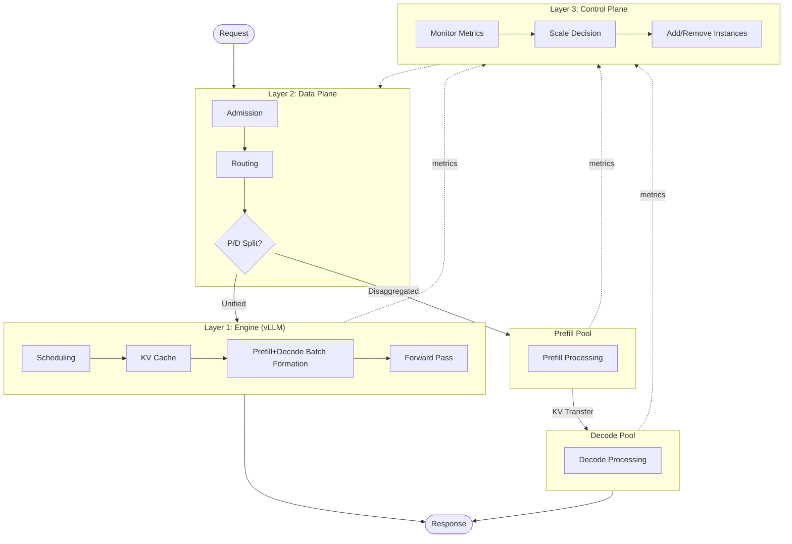
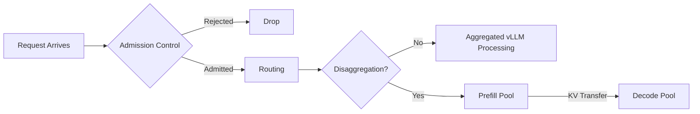

# The Physics of High-Fidelity Distributed Inference Platform Simulation

Production LLM inference platforms are distributed systems where routing policies, admission control, autoscaling, and engine-level scheduling all interact to determine latencies and throughput. How do you explore how different policies and configurations affect these KPIs before deploying to production? Testing a new routing scorer or autoscaling threshold on live traffic risks cascading bugs across the fleet, while building separate test environments burns GPU-hours and still can't predict interactions between cluster-level policies and engine-level batch dynamics.

The answer is **end-to-end simulation**: model the entire distributed inference stack to explore how policies and configurations affect latencies and throughput for your workloads. What does it take to build a simulator accurate enough to guide these decisions? The challenge lies in capturing the right mechanisms across all three layers. At the engine level, batches process together — all requests wait for the slowest operation to finish, so KV cache fills trigger preemptions and long prompts stall short decodes. At the cluster level, routing policies operate on stale cache state, admission control gates overload, and prefill/decode disaggregation trades utilization for latency. At the control plane, autoscalers react to lagged metrics, creating oscillations. When these couplings are not modeled, predictions diverge: a back-of-the-envelope model might predict 50ms time-to-first-token while production measures 200ms.

<!-- more -->

## Building Fidelity from First Principles

[BLIS](https://github.com/inference-sim/inference-sim) (Blackbox Inference Simulator) models inference serving through discrete-event simulation, advancing from event to event rather than stepping through continuous time. This approach runs orders of magnitude faster than real-time, requires no GPUs, and evaluates hours of production traffic in seconds.

BLIS simulates the entire distributed inference platform—routing policies directing traffic across instances, admission control gating overload, autoscalers adding/removing capacity, and engine-level batch scheduling processing requests. This full-stack fidelity enables **capacity planning** and **configuration search**: determining instance count, GPU type, TP degree, routing weights, and admission thresholds. Without modeling these distributed system couplings, planners predict linear scaling where production saturates, miss SLO violations from routing pile-on, or deploy autoscalers that oscillate between under- and over-provisioning.

By modeling production systems ([vLLM](https://github.com/vllm-project/vllm), [llm-d](https://llm-d.ai)) behavior, BLIS enables safe experimentation before deployment:

- **Routing policies** — Test new scorer combinations and weights
- **Admission control** — Explore saturation thresholds and flow control strategies
- **Capacity planning** — Compare model/GPU/TP configurations
- **Workload analysis** — Test how switching from TP=2 to TP=4 affects tail latency under production traffic patterns

Physics-based dynamics with learnable latency components generalize across model architectures and hardware while maintaining production fidelity - meaning you can test new configurations on a laptop in seconds without needing production infrastructure. This rapid iteration enables projects like [ADRS](https://sky.cs.berkeley.edu/project/adrs/) (AI-Driven Research Systems) to develop and validate new serving policies and algorithms through fast simulation loops before production deployment.

This article walks through what it takes to build that level of fidelity — from token batching physics to distributed orchestration, by following a request's end-to-end journey through the system to see where every millisecond of complexity originates.

## A Request's Journey: The Hidden Complexity

A user hits enter, and fifty milliseconds later the first token appears. What happened in between? Three architectural layers working together: the inference engine (vLLM), the data plane (cluster orchestration), and the control plane (autoscaling), all of which high-fidelity simulation must model.



### Layer 1: The Engine (vLLM)

> **TL;DR:** Batched execution couples requests together - a heavy prompt in the batch slows down fast decodes running alongside it. BLIS models the full vLLM pipeline (continuous batching, request scheduling and preemption, KV cache pressure, chunked prefill) and predicts forward pass timing using a generalizable model that runs on CPUs without needing real GPUs.

The inference engine does not process requests individually. It processes them in continuously evolving batches. A **step** is one GPU forward pass that advances every request in the batch, either processing prompt tokens (prefill) or generating the next output token (decode). The slowest operation determines when the step completes.

Why does this matter? Consider a batch with three requests decoding single tokens (fast, memory-bound) and one request processing a 512-token prompt (slow, compute-bound). Everyone waits for the slowest. This is not an edge case - batch composition constantly shifts as new requests arrive and completed ones leave.

**What BLIS captures.** vLLM's complexity comes from continuous batching (requests join and leave mid-flight), mixed prefill-decode execution (fast decode waits for slow prefill), block-level KV cache management (prefix reuse, preemption, CPU offloading when GPU memory fills), and chunked prefill (breaking large prompts into smaller pieces). BLIS models all of these mechanisms because they determine when requests complete.

**How BLIS predicts step time without GPUs.** BLIS uses a trained model that combines physics-based basis functions with learned corrections:

$$
t_{\text{step}} = \sum_{i} \beta_i \cdot \phi_i(\text{batch}, \text{LLM}, \text{hardware})
$$

where $\phi_i$ are basis functions that capture computational physics - batch (batch size and sequence lengths), LLM (model architecture), and hardware (compute and memory bandwidth) - and $\beta_i$ are coefficients trained on real vLLM traces that correct for hardware-specific bottlenecks. This approach generalizes across LLM architectures, hardware configurations, and tensor parallelism degrees, enabling seamless experimentation with any model-GPU-TP combination without per-configuration calibration. Accurate forward pass predictions drive accurate end-to-end latency metrics.

### Layer 2: The Data Plane (Cluster Orchestration)

> **TL;DR:** Production clusters run multiple vLLM instances behind a routing gateway. BLIS models saturation-based admission control, composable weighted routing with in-flight tracking, configurable cache signal staleness, and prefill/decode disaggregation. Pluggable interfaces for admission policies, routing scorers, and disaggregation deciders enable algorithm discovery—test new serving policies without writing production code.

Production systems run multiple vLLM instances behind a gateway layer. BLIS models the data plane through pluggable interfaces for admission policies, saturation detectors, routing scorers, disaggregation deciders, so you can bring your own custom algorithms and test them against production workloads without writing production code or risking live traffic!



**Admission control** determines whether requests enter the system. BLIS models saturation-based admit/reject decisions: when cluster load exceeds thresholds, incoming requests are rejected or queued rather than overwhelming instances. This prevents queue explosion during traffic spikes and avoids pile-on where burst arrivals flood the same "best" instance.

**Routing** assigns each request to an instance by scoring on weighted signals - prefix cache hits, queue depth, KV utilization. The challenge: burst arrivals cause all routing decisions to see the same stale state and pick the same "best" instance. BLIS models in-flight tracking (counting already-dispatched requests) and signal staleness (cache state queries a 2-second-old snapshot, matching llm-d's ZMQ propagation delay).

**Prefill/decode disaggregation** separates compute-bound prefill from memory-bound decode onto dedicated GPU pools, allowing each to be sized for its bottleneck. Requests process prefill first, then transfer their KV cache over the network to a decode instance. BLIS models the full pipeline: prefill routing, KV transfer, decode routing, and fair-share bandwidth contention when multiple transfers run concurrently.

### Layer 3: The Control Plane (Autoscaling)

> **TL;DR:** Real autoscaling experiments are expensive - feedback loops spanning minutes (HPA scrapes, pod scheduling, VM provisioning, model loading) require 30+ minutes and 10+ GPU replicas per test. BLIS models llm-d's WVA (Workload Variant Autoscaler) four-stage pipeline with pluggable Collector/Analyzer/Optimizer/Actuator interfaces, compressing experiments to seconds on a laptop.

Autoscaling dynamically adjusts the number of running instances to match demand, adding capacity during traffic spikes and removing it when load drops to avoid paying for idle GPUs. In production systems, this balance between meeting SLOs and controlling costs happens automatically through feedback loops spanning minutes—HPA scrapes, Kubernetes pod scheduling, VM provisioning, and model weight loading all contribute latency before a new replica begins serving. A single experiment needs 30+ minutes of real traffic across 10+ GPU replicas. Each configuration burns real GPU-hours.

**What BLIS captures.** BLIS models llm-d's WVA four-stage pipeline — Collect, Analyze, Optimize, Actuate, with pluggable interfaces. **Collector** observes per-replica metrics, **Analyzer** detects saturation and emits scaling signals, **Optimizer** decides which GPU types to add/remove respecting multi-model inventory constraints, and **Actuator** applies decisions with configurable delay.

**Why simulate?** BLIS compresses 30-minute experiments into seconds on a laptop, enabling rapid iteration without burning production GPU-hours. Researchers can sweep scaling thresholds to find optimal trigger points, compare analyzer strategies under identical workloads, and test multi-model scenarios where scaling one model's replicas steals GPUs from another. Each pluggable interface becomes a research hook - swap in a cost-aware Optimizer that prioritizes cheaper GPU types, or test an Analyzer that predicts load spikes from traffic patterns. The result: discover and validate better autoscaling policies before deployment, with full control over feedback delays, provisioning latencies, and actuation lags that determine real-world scaling behavior.

## BLIS in Action: Simulating a Configuration Decision

Consider a configuration decision: you are deploying Qwen3-14B for chatbot workloads at 50 req/s with 8 instances. Does routing policy matter? What about hardware choice?

Testing this in production means provisioning separate GPU pools, running 30+ minutes of traffic per setup and burning GPU-hours to discover the answer. With BLIS, you can simulate these configurations in seconds on a laptop:

```bash
# Install and build BLIS
git clone https://github.com/inference-sim/inference-sim.git
go build -o blis main.go

# H100 with round-robin routing
./blis run --model qwen/qwen3-14b --workload chatbot --rate 50 \
  --num-instances 8 --tp 2 --hardware H100 --routing-policy round-robin

# H100 with prefix-aware routing
./blis run --model qwen/qwen3-14b --workload chatbot --rate 50 \
  --num-instances 8 --tp 2 --hardware H100 --routing-policy weighted \
  --routing-scorers "prefix-affinity:2,queue-depth:1"

# A100-80 with prefix-aware routing
./blis run --model qwen/qwen3-14b --workload chatbot --rate 50 \
  --num-instances 8 --tp 2 --hardware A100-80 --routing-policy weighted \
  --routing-scorers "prefix-affinity:2,queue-depth:1"
```

**Simulated Results:**

| Configuration | Predicted P99 TTFT | Key Finding |
|---------------|----------|-------------|
| H100 (round-robin) | 12.1ms | Baseline with naive routing |
| H100 (prefix-aware) | 11.3ms | **7% improvement** from KV cache reuse |
| A100-80 (prefix-aware) | 45.8ms | **4× slower than H100** — hardware choice dominates |

**What the simulation predicts:** Prefix-aware routing delivers measurable gains on H100, but hardware choice has far greater impact. These simulated predictions guide configuration decisions without provisioning real GPUs—validation against production systems (the topic of our next article) confirms BLIS accuracy.

## From Modeling to Validation

We have covered how building an end-to-end high-fidelity systems simulator like BLIS requires careful modeling of the physics of engine-level batch scheduling and processing, data plane coordination, and control plane feedback loops. BLIS combines physics-based dynamics with learned corrections, running entirely on CPUs with pluggable interfaces for each component to enable extremely fast algorithm discovery and configuration search. 

But **how do we know this modeling is accurate?**

We have validated BLIS against production workloads running on real systems and compared its prediction accuracy to commercial inference simulators. The methodology and results, including cross-system accuracy benchmarks and what accuracy is achievable without per-configuration tuning, are detailed enough to deserve their own article.

**Coming Soon: Validating Against Ground Truth** — Quantifying BLIS accuracy on real workloads, how validation catches regressions before they ship, and why validation is a discipline, not a step.

---

*This is the first article in a series on BLIS's architecture. Next: **Validating Against Ground Truth** - quantifying accuracy on real workloads and the methodology behind it.*
