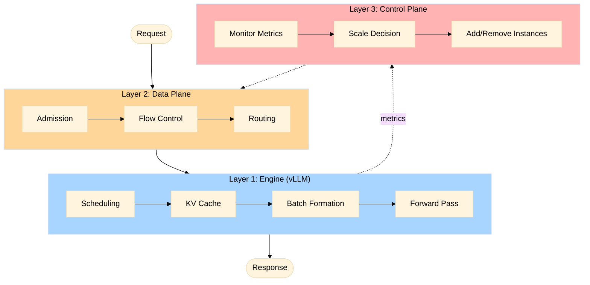

# The Physics of High-Fidelity Inference Simulation

Every capacity decision in LLM inference carries real stakes. Choosing the wrong GPU type or tensor parallelism degree means overspending by millions or underdelivering on latency SLOs, while testing a new routing policy on live traffic risks cascading bugs across the entire fleet.

What does it take to build a simulator accurate enough to guide these decisions? The challenge lies in capturing the right mechanisms. Inference engines process batches in lockstep where all requests wait for the slowest operation, KV cache fills trigger preemptions, and a single long prompt stalls dozens of short decodes. When these couplings are not modeled, predictions diverge from reality - a back-of-the-envelope model might predict 50ms time-to-first-token while production measures 200ms.

<!-- more -->

## Building Fidelity from First Principles

[BLIS](https://github.com/inference-sim/inference-sim) (Blackbox Inference Simulator) models inference serving through discrete-event simulation, advancing from event to event rather than stepping through continuous time. This approach runs orders of magnitude faster than real-time, requires no GPUs, and evaluates hours of production traffic in seconds.

The simulator achieves this fidelity by modeling the mechanisms that determine latency: requests coupling through shared batch steps, KV cache pressure triggering preemptions, and prefill-decode competition for GPU cycles. When these mechanisms are captured accurately, predictions track production behavior.

Beyond prediction accuracy, physics-based modeling enables experimentation with mechanisms that do not yet exist in production. When the simulator captures the actual system dynamics, it becomes a testbed for innovation:

- **Novel routing and admission control policies** — Test before writing production code
- **Scheduling algorithms** — Explore priority schemes and batch formation
- **Architecture experiments** — Compare serving topologies and hardware
- **Algorithm discovery** — Iterate fast, cheap, reproducible

Physics-based models predict what could happen under new conditions and policies, while empirical models trained on historical data predict only what has been observed. BLIS enables testing new serving algorithms on a laptop in seconds without requiring production infrastructure.

This article walks through what it takes to build that level of fidelity — from token batching physics to distributed orchestration, by following a request's 50-millisecond journey through the system to see where every millisecond of complexity originates.

## A Request's Journey: The Hidden Complexity

A user hits enter, and fifty milliseconds later the first token appears. What happened in between? Three architectural layers working together: the inference engine (vLLM), the data plane (cluster orchestration), and the control plane (autoscaling), all of which high-fidelity simulation must model.

### Layer 1: The Engine (vLLM)

The inference engine does not process requests individually. It processes them in continuously evolving batches. A **step** is one GPU forward pass that advances every request in the batch, either processing prompt tokens (prefill) or generating the next output token (decode). The slowest operation determines when the step completes.

Why does this matter? Consider a batch with three requests decoding single tokens (fast, memory-bound) and one request processing a 512-token prompt (slow, compute-bound). Everyone waits for the slowest. This is not an edge case - batch composition constantly shifts as new requests arrive and completed ones leave.

**What BLIS models from vLLM.** vLLM uses continuous batching where requests join and leave mid-flight and prefill and decode can execute together in the same batch, block-level KV cache management with prefix reuse and preemption, chunked prefill to break large prompts into smaller pieces, and KV cache offloading to CPU memory when GPU memory fills. BLIS models all of this: mixed prefill-decode batching, KV allocation and eviction, chunked prefill, CPU KV offloading, and dynamic batch membership.

**How BLIS predicts step time without GPUs.** BLIS uses a trained model that combines physics-based basis functions with learned corrections:

$$
t_{\text{step}} = \sum_{i} \beta_i \cdot \phi_i(\text{batch}, \text{model}, \text{hardware})
$$

where $\phi_i$ are basis functions that depend on batch composition, model architecture, and hardware specifications, and $\beta_i$ are coefficients trained on real vLLM traces. The simulator runs on CPU and produces predictions in a fraction of the time real execution would take.

### Layer 2: The Data Plane (Cluster Orchestration)

The inference engine handles individual requests within a single vLLM instance, but production systems run multiple instances behind a routing layer. The data plane orchestrates traffic across this cluster through four sequential gates, each adding latency and complexity that determines whether your predictions match reality.

**Gate 1: Admission Control.** Before requests enter the system, they pass through a rate limiter. BLIS models token bucket admission control where each request consumes tokens proportional to its prompt length. When the bucket empties, requests are rejected immediately. This matches production admission controllers that prevent queue explosion during traffic spikes. Without modeling this gate, simulated throughput overshoots reality by admitting more load than the system can handle.

**Gate 2: Flow Control (Gateway Queue).** Even after admission, requests do not route immediately. They wait in a gateway queue until the cluster has capacity. BLIS holds requests when saturation exceeds a threshold — computed as the maximum of queue depth divided by a queue threshold and KV cache utilization divided by a cache threshold, averaged across all instances. When saturation drops below 1.0, the queue dispatches requests with fresh routing state. This late binding prevents pile-on: without it, ten routing decisions might see the same stale queue depth and all pick the same instance, creating a 20-40ms latency spike as that instance becomes overloaded. The gateway queue is not in production llm-d yet, but BLIS shows it reduces time-to-first-token by 20-40% under load spikes — a mechanism that could be contributed back.

**Gate 3: Routing.** With capacity available, the router scores each instance using a weighted combination of signals: `precise-prefix-cache:2, queue-depth:1, kv-utilization:1`. This matches llm-d's default production profile. But here is the critical complexity: **signal freshness varies by tier**. Router-local signals like in-flight request counts are always current — the router increments them synchronously on every dispatch. Instance-reported signals like queue depth and KV utilization refresh periodically (every 10ms by default), so they are slightly stale. Cache state signals have a 2-second blind spot by default, modeling llm-d's ZMQ event propagation delay. When the router scores an instance, it queries a frozen snapshot of that instance's KV cache from two seconds ago, not live state. Ten routing decisions in a row might all see the same stale cache utilization and pile onto one instance. BLIS models this staleness explicitly because that is the production reality — and it matters. Stale signals cause routing suboptimality that shows up as +1ms here, +2ms there, compounding across thousands of requests.

**Gate 4: Prefill/Decode Orchestration (if disaggregated).** When prefill and decode run on separate GPU pools, requests travel through an additional pipeline. Long prompts route to the prefill pool first, process their tokens, then transfer the KV cache over the network to a decode pool instance. BLIS models the coordinated routing decisions (prefill instance selection, decode instance selection with affinity), the KV transfer cost (base latency 15-30ms depending on configuration, plus bandwidth-limited data transfer), and transfer contention when multiple KV caches move concurrently. Time-to-first-token in disaggregated mode is prefill time + transfer time + first decode step, and every millisecond counts. Without modeling the transfer, latency predictions for disaggregated serving are simply wrong.

Why does the data plane matter? Because under load, these gates compound. A request admitted at the edge might wait 2ms in the gateway queue, get routed to a suboptimal instance because cache signals were stale (+5ms queueing), then wait for KV transfer (+20ms). That is 27 milliseconds of cluster-level latency before a single token is generated. Miss any gate, and your capacity planning is off by 20-50%.

### Layer 3: The Control Plane (Autoscaling)

[To be written - WVA pipeline, feedback delays]

### The Complete Journey

[To be written - integration of all three layers with end-to-end trace]

## BLIS in Action: A Real Scenario

[To be written - routing policy comparison or capacity planning example with validation numbers]

## From Modeling to Validation

[To be written - recap + tease validation article]

---

*This is the first article in a series on BLIS's architecture. Next: **Validating Against Ground Truth** - how BLIS achieves single-digit percent error on real workloads.*
