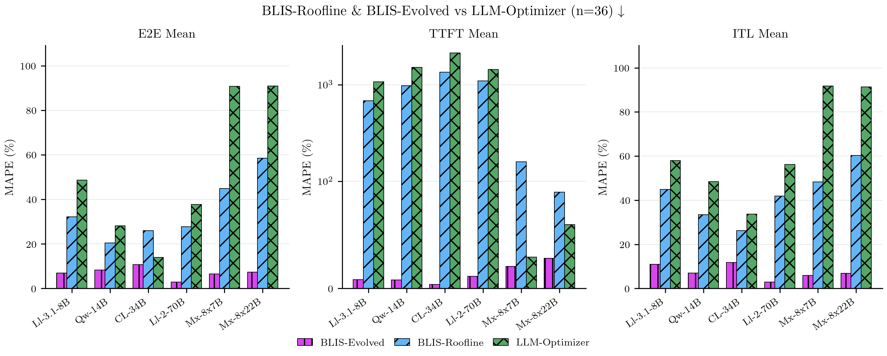
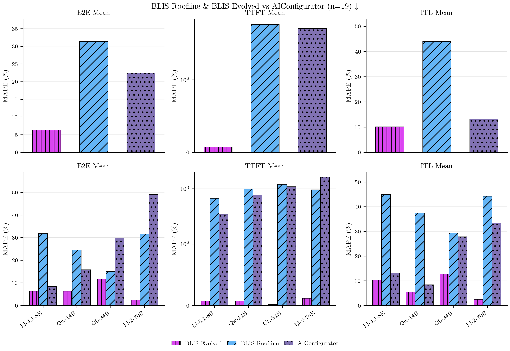
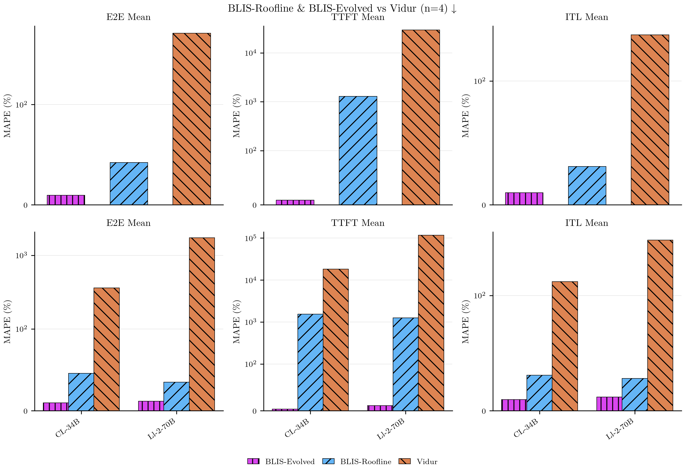
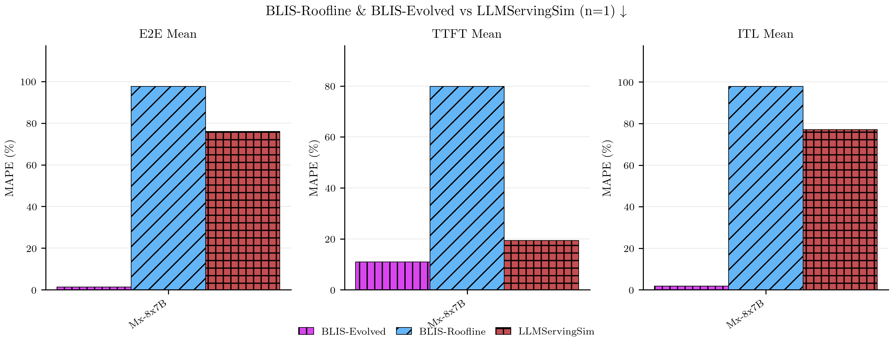
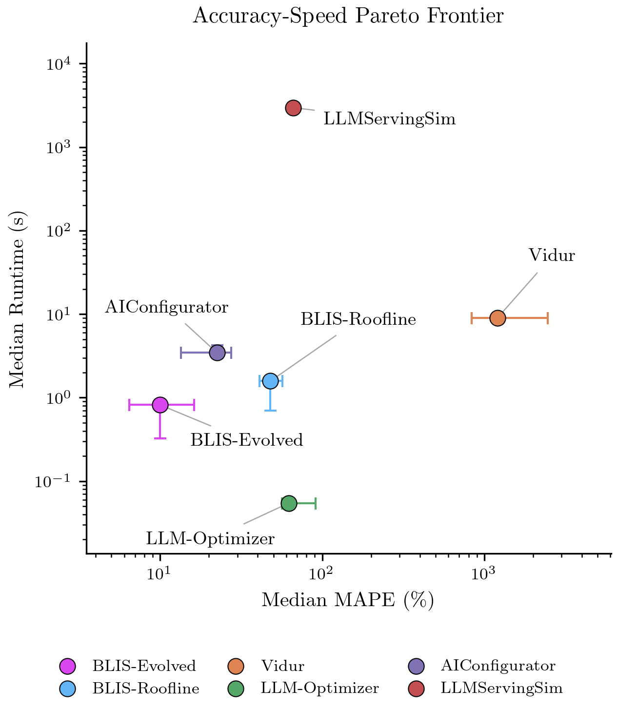

# The Inference Simulator Showdown: Which Tool Actually Delivers?

Choosing the right inference simulator can save weeks of experimentation and thousands in compute costs. But which one actually works? We tested five popular LLM inference simulators head-to-head across 38 real-world experiments on production hardware.

<!-- more -->

## Why Simulator Choice Matters

Imagine you are deploying Mixtral-8x7B for your AI-powered coding assistant. Four GPUs or eight? Which hardware meets your SLO targets? Running real experiments could take days and cost thousands. A simulator promises answers in minutes — if you trust its predictions.

We tested five simulators across 38 production experiments to find out which ones deliver. The results: accuracy ranged from 1% to 76% error on identical workloads. Speed varied from milliseconds to hours. Some tools couldn't run two-thirds of our experiments.

The stakes are high. A 50% prediction error translates directly to over-provisioning or under-provisioning GPUs. At H100 cloud rates, mis-sizing a production cluster by even 20-30 GPUs costs six figures annually in wasted capacity or missed SLOs.

This guide breaks down which simulator to use for capacity planning, configuration search, and algorithm discovery — backed by hard data from 38 experiments across six models, four workload types, and three GPU types.

## Meet the Contenders

Five popular simulators. Five completely different bets on how to predict LLM inference performance.

**[Vidur](https://github.com/microsoft/vidur)** replays your exact workload through discrete-event simulation, using profiled GPU kernel times to model vLLM's scheduling decisions. High fidelity to scheduler behavior, but you need to profile each model first. Pre-profiled kernels are available only for vLLM v0.

**[LLMServingSim](https://github.com/casys-kaist/LLMServingSim)** takes a different path—discrete-event simulation with fine-grained network modeling via [astra-sim](https://github.com/astra-sim/astra-sim). The catch? ~6 minutes per experiment.

**[LLM-Optimizer](https://github.com/bentoml/llm-optimizer)** takes the opposite approach: analytical modeling from first principles. Query HuggingFace for LLM config, run the roofline calculation, get an answer in 0.1 seconds. No request scheduling or queueing behavior captured.

**[AIConfigurator](https://github.com/ai-dynamo/aiconfigurator)** uses operation-level profiling—break inference into GEMM, attention, communication ops, measure them on hardware, then compose the results. Dense models only.

**[BLIS](https://github.com/inference-sim/inference-sim)** combines discrete-event simulation with latency models comprising analytical physics-based basis functions and coefficient training. Multiple latency modes available — we are comparing Roofline (analytical baseline) and Evolved (learned coefficients).

Let us answer the question: which approach actually delivers?

## How We Tested

We ran **38 experiments** on production hardware using vLLM v0.15.1, then asked each simulator to predict the results.

The test matrix: **6 models** spanning dense and MoE architectures—Llama-3.1-8B, Qwen3-14B, CodeLlama-34B, Llama-2-70B (dense), and Mixtral-8x7B, Mixtral-8x22B (MoE). **3 GPU types:** H100, A100-80GB, L40S. Serving parameters swept: tensor parallelism (1/2/4/8), CPU offload (on/off), vLLM GPU memory utilization (0.90/0.95), vLLM chunk size (1024/2048/4096).

For workloads, we used **[ServeGen](https://github.com/alibaba/ServeGen) multi-turn traces from production logs**, split into four categories:

- **General-Purpose:** Chatbot traffic with variable request patterns
- **Code Generation:** GitHub Copilot-style code assistant traffic
- **Role-Playing:** Conversational assistant traffic
- **Reasoning:** Tasks with extended thinking time

Every experiment tracked three latency metrics: **E2E Mean MAPE** (end-to-end latency), **TTFT Mean MAPE** (time to first token), and **ITL Mean MAPE** (inter-token latency), capturing whether a simulator gets the full user experience right, not just throughput.  

> **What is MAPE?**
> Mean Absolute Percentage Error measures prediction accuracy: `|predicted - actual| / actual x 100`. A simulator with 15% MAPE means its predictions are off by 15% on average. Lower is better, and even 30-40% error can derail capacity planning decisions.

## Accuracy and Coverage: Who Gets It Right?

Picture this: you are deploying Mixtral-8x7B on A100 nodes with TP=4. You have read the accuracy benchmarks, picked your simulator, fired it up, and it tells you it does not support MoE models! Or A100s. Or diverse TP configurations. Before you ever question the predictions, coverage gaps have already made the decision for you.

Only **BLIS** (both variants) covers all 38 experiments. Since no other simulator runs the full test suite, we compare BLIS against each simulator on their supported experiments.

| Simulator | Experiments Covered | Coverage | Key Limitations |
|-----------|---------------------|----------|-----------------|
| **BLIS** (both variants) | 38/38 | 100% | None—full model, workload, GPU, and serving parameter support |
| **LLM-Optimizer** | 36/38 | 94.7% | No L40S hardware profiles (H100/A100 only); MoE approximated as dense; limited vLLM argument support |
| **AIConfigurator** | 19/38 | 50% | Dense models & H100 only|
| **Vidur** | 4/38 | 10.5% | Requires pre-built model profiles; only CodeLlama-34B & Llama-2-70B |
| **LLMServingSim** | 1/38 | 2.6% | Only 1 model with profiled coefficients matching our test set (Mixtral-8x7B); supports only 2 models total on H100; prohibitive runtime limits broader testing |

**Coverage gaps compound.** No MoE support eliminates Mixtral evaluations. H100-only means no cost-optimization across GPU types. Multiply those constraints and a simulator advertising "high accuracy" may only deliver it on a narrow slice of what production actually looks like.

**Head-to-head accuracy comparisons on shared experiments:**

*Figure 1: Accuracy comparison between BLIS and LLM-Optimizer across 36 shared experiments on H100/A100-80GB with all 6 models. BLIS-Evolved achieved 11.79% E2E MAPE and 22.81% TTFT MAPE. Pure roofline models (BLIS-Roofline, LLM-Optimizer) miss queueing delays and TP communication overhead. LLM-Optimizer approximates MoE as dense and lacks L40S GPU support.*

*Figure 2: Accuracy comparison between BLIS and AIConfigurator across 19 shared experiments on H100 with dense models only (Qwen3-14B, CodeLlama-34B, Llama-2-70B, Llama-3.1-8B). AIConfigurator uses operation-level profiling but excludes MoE architectures and A100/L40S GPUs.*

*Figure 3: Accuracy comparison between BLIS and Vidur across 4 shared experiments with 2 models (CodeLlama-34B, Llama-2-70B) on H100 only. Vidur requires pre-built model profiles and does not support MoE architectures.*

*Figure 4: Accuracy comparison between BLIS and LLMServingSim on 1 shared experiment (Mixtral-8x7B TP4, 2000-request cluster workload). BLIS-Evolved achieved 1.34% E2E MAPE, LLMServingSim 76%, and BLIS-Roofline 97.69%. BLIS-Evolved is 72.8× more accurate than roofline and 56.7× better than LLMServingSim on this high-TP MoE configuration.*

**Accuracy varies dramatically across simulators.** Across their supported experiments, median E2E error ranges from 7.4% (BLIS-Evolved) to 619% (Vidur) - an 83× spread. TTFT error spans 12.6% (BLIS-Evolved) to 29,783% (2,355× spread). ITL error ranges 9.8% (BLIS-Evolved) to 259% (26× spread). BLIS-Evolved achieves the best accuracy overall. However, while its E2E latency prediction is strong (11.79% MAPE), TTFT accuracy is weaker (22.81% MAPE) - nearly 2× worse. This means first-token latency predictions are less reliable than overall request latency. For workloads where time-to-first-token dominates user experience, this gap matters.

## Speed vs. Accuracy: The Pareto Frontier

Accuracy tells you whether to trust a simulator. Speed tells you whether you can practically use it.

| Simulator | Median Runtime (s) | Speedup vs. Real |
|-----------|-------------------|------------------|
| **LLM-Optimizer** | 0.1 | 22,166× |
| **BLIS-Evolved** | 0.8 | 1,479× |
| **BLIS-Roofline** | 1.6 | 766× |
| **AIConfigurator** | 3.5 | 349× |
| **Vidur** | 9.1 | 134× |
| **LLMServingSim** | 353.3 | 0.4× |

*Median runtime and speedup relative to real GPU experiments. LLM-Optimizer is 22,000× faster, BLIS-Evolved 1,500× faster, while LLMServingSim is actually slower than running real experiments. Practical impact? Simulating 100 experiments takes 10 seconds (LLM-Optimizer), 80 seconds (BLIS-Evolved), 15 minutes (Vidur), or 10 hours (LLMServingSim).*

*Figure 5: Speed vs accuracy Pareto frontier across all 38 experiments. LLM-Optimizer occupies the fast-but-rough corner (0.1s runtime, instant feedback, no queueing dynamics). LLMServingSim sits in the slow-but-detailed region (353s runtime, yet higher MAPE than BLIS-Evolved—fidelity alone does not guarantee accuracy). BLIS-Evolved hits the frontier elbow (0.8s runtime, 11.79% E2E MAPE), balancing accuracy and speed. Error bars show median runtime with interquartile range.*

**Pick your point on the curve.** One deployment decision? BLIS-Evolved (0.8s) once. Searching 1,000 configs? 13 minutes with BLIS-Evolved vs 98 hours with LLMServingSim. Training an RL agent? Only LLM-Optimizer (0.1s) makes millions of episodes feasible.

## Which Simulator For Your Use Case

### Capacity Planning & Configuration Search

**Accuracy matters most.** A fast simulator with 50% error means wrong resource decisions—overprovision and waste budget, or underprovision and miss SLOs. BLIS-Evolved delivered 11.79% E2E error and 22.81% TTFT error across 38 experiments (Figure 1). Pure roofline models miss queueing delays and communication overhead—errors that compound when planning at scale.

**For capacity planning with SLO targets:** Use **BLIS-Evolved** if you need broad coverage across models/GPUs/workloads at 0.8s per run. It supports vLLM arguments (chunk size, GPU memory utilization, CPU offload) and tail latency metrics (P90/P99). Analytical simulators (LLM-Optimizer, AIConfigurator) only predict mean latency and cannot validate tail latency SLOs.

**Use Vidur if scheduler-level fidelity matters more than speed.** Vidur replicates vLLM's scheduling logic at the finest grain, making it the most faithful simulator for understanding queueing behavior. Trade-off: requires profiling each model upfront and runs slower (9.1s median runtime). Best for deep investigations of specific model-hardware combinations.

**For rapid config space exploration (mean latency only):** Use **LLM-Optimizer** first, then validate with BLIS-Evolved. At 0.1 seconds per config, LLM-Optimizer sweeps 1,000 candidates in 2 minutes to eliminate obviously bad configs (wrong TP, insufficient memory). But roofline accuracy degrades on high-parallelism and MoE workloads (Figure 1)—validate final candidates with BLIS-Evolved (0.8s per config, 13 minutes for 1,000 runs) before making resource commitments.

**LLMServingSim** At ~6 minutes per run, LLMServingSim is too slow for the iterative config exploration capacity planning requires.

### AI-Driven Algorithm Discovery

An exciting emerging area: using RL or AI-driven search to *discover* better serving algorithms ([ADRS](https://sky.cs.berkeley.edu/project/adrs/)). The simulator becomes a training environment for exploring scheduling policies and batching strategies.

**Speed dominates.** Algorithm discovery loops need many simulations. At ~6 minutes per run, LLMServingSim is impractical. **AIConfigurator and Vidur** also fall short on speed - they are better for validating hand-designed systems than training. You need sub-second simulation for algorithm discovery to complete in reasonable time.

**Use LLM-Optimizer for algorithm discovery.** At 0.1s per run, it's 8× faster than BLIS-Evolved and makes large-scale exploration feasible. Misses queueing dynamics, but for discovery you are learning *relative* performance across policies, not absolute accuracy. However, it is limited to single-instance—cannot model multi-instance features like routing.

**Use BLIS-Evolved for multi-instance algorithms** At 0.8s per run, BLIS-Evolved is 8× slower than LLM-Optimizer. If you specifically need multi-instance capabilities such as routing policy exploration and can accept the 8× slowdown, then use BLIS-Evolved for this use-case.

## The Bottom Line

There is no universal best simulator - only the best simulator *for your problem*.

Across 38 experiments, we measured a massive accuracy spread between simulators. We evaluated on three axes: **Accuracy** (can you trust it?), **Speed** (can you explore with it?), **Coverage** (can it model your deployment?). Fast but inaccurate wastes time. Accurate but slow limits exploration. Neither matters if coverage gaps block your architecture.

**For capacity planning:** BLIS-Evolved offers the best accuracy-coverage trade-off (11.79% E2E MAPE), but TTFT prediction is weaker (22.81% MAPE). Vidur provides scheduler-level fidelity if you can invest in per-model profiling.

**For algorithm discovery:** LLM-Optimizer wins decisively at 0.1s per run—8× faster than any alternative. BLIS-Evolved is too slow for algorithm discovery loops.

**For rapid exploration:** LLM-Optimizer's analytical approach delivers instant feedback. Use it to prune configuration spaces, then validate finalists with a discrete-event simulator.

Marketing claims are not validation. Run the simulator on *your* model, *your* hardware, *your* workload, then compare against real measurements. Test before you trust.

## Limitations and Future Work

This evaluation focuses on single-instance vLLM serving accuracy. What we did not test:

**Multi-instance cluster dynamics:** Our 38 experiments measured single-server latency prediction. Real deployments use load balancing, request routing, and autoscaling across multiple instances. How well do simulators predict cluster-level behavior under load balancing policies? We did not test this.

**Cost modeling:** Capacity planning is not just about latency—it is about cost per token, GPU utilization, and total cost of ownership. None of the simulators we tested provide built-in cost models. Future work should evaluate cost prediction accuracy alongside latency.

**Production drift:** Models update, workloads shift, hardware changes. How quickly do simulators become stale? How much re-profiling or re-training is needed? We tested accuracy at a point in time, not over time.

Acknowledging these gaps does not diminish the findings—it clarifies their scope. Single-instance latency prediction is the foundation, but production serving is a bigger problem.
