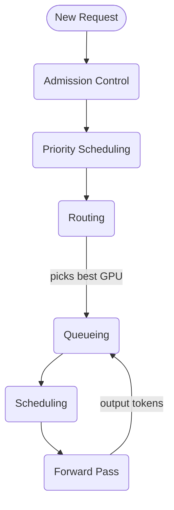
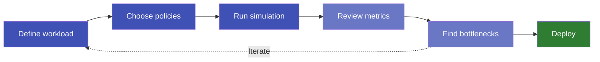
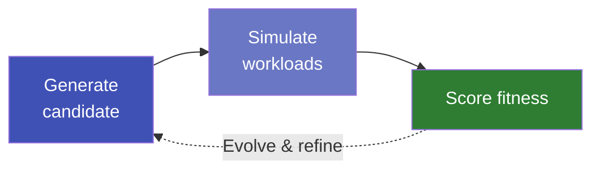

# Why Simulate Before You Scale

Deploying large language models in production is one of the most expensive infrastructure decisions an organization can make. A single GPU cluster serving a flagship model can cost millions of dollars per year. Yet most teams make their first scaling decisions based on rough estimates, vendor benchmarks, or — worst of all — trial and error on live hardware.

What if you could test your deployment plan *before* spending a dollar on GPUs?

<!-- more -->

## The Problem: Scaling Blind

When a team decides to serve an LLM at scale, they face a cascade of interconnected questions:

- **How many GPU instances** do we need for our expected traffic?
- **What happens during a traffic spike** — does latency degrade gracefully, or does the system fall over?
- **Which model fits our hardware budget** while still meeting our latency targets?
- **How should we route requests** across instances to keep response times low?

These questions are deeply intertwined. Changing the number of instances affects routing behavior, which affects queue depths, which affects latency. Traditional back-of-the-envelope math can't capture these dynamics. And running experiments on real GPUs is slow, expensive, and hard to reproduce.

## The Insight: A Flight Simulator for LLM Infrastructure

The aerospace industry doesn't test new wing designs by building full aircraft and hoping for the best. They simulate. The same principle applies to inference infrastructure.

**BLIS** (Blackbox Inference Simulator) is a discrete-event simulator purpose-built for LLM serving systems. It models the full lifecycle of every request — from arrival through routing, queuing, batching, and token generation — and produces the same metrics you'd measure in production: time to first token, inter-token latency, throughput, and memory utilization.

The key difference: **it runs on your laptop in seconds, with no GPUs required.** And this isn't a rough approximation — BLIS produces highly accurate predictions of real-world serving metrics, validated against production inference engines. The numbers you see in simulation translate directly to capacity decisions you can trust.

*Above the line: cluster-level decisions. Below: per-instance token generation loop.*

## What You Can Do With It

### Plan Capacity With Confidence

Run simulations at different instance counts, GPU configurations, and traffic patterns — including spikes, mixed workloads, and priority classes. BLIS tells you exactly where your latency targets break and how the system degrades, so you provision for reality rather than guesswork. Every simulation is deterministic and reproducible: same inputs, byte-identical results, fully auditable.

### Compare Policies Side by Side

Routing strategies, admission control rules, and scheduling algorithms all interact in non-obvious ways. BLIS lets you swap any of these independently and measure the impact on your actual workload distribution — not a generic benchmark.

*The simulate-learn-act loop: iterate in seconds, deploy with confidence.*

### Discover New Algorithms With AI

Capacity planning and policy comparison answer "which *known* strategy is best?" The deeper opportunity is discovering strategies that no human would design from scratch.

BLIS was custom-built to be a foundation for **AI-Driven Research and Strategy Discovery (ADRS)**. Routing, scheduling, admission, and batch formation are each a swappable interface — AI frameworks can inject candidate algorithms at any layer, evaluate them across diverse workloads in seconds, and evolve the best performers. Thousands of candidates per hour, with deterministic fitness comparisons and rich multi-objective signals (latency, throughput, fairness, SLO attainment).

*AI proposes candidate strategies; BLIS evaluates them in seconds; the best survive and evolve.*

## The Bottom Line

GPU infrastructure is too expensive for guesswork. BLIS gives you a way to explore your deployment design space — model choices, instance counts, routing policies, memory configurations — before committing real resources. The cost of a simulation is measured in seconds of laptop time. The cost of getting it wrong in production is measured in dollars, downtime, and user experience.

**Get started:** [Run your first simulation](../../getting-started/quickstart.md) in under a minute, or walk through an [end-to-end capacity planning tutorial](../../getting-started/tutorial.md).
