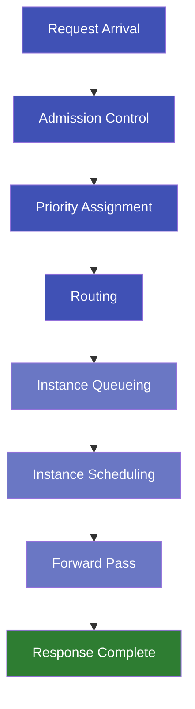
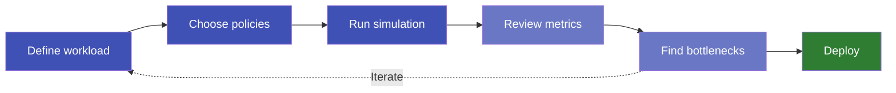
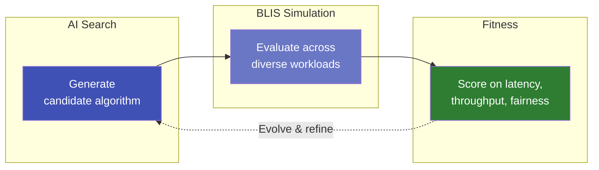

# Why Simulate Before You Scale

Deploying large language models in production is one of the most expensive infrastructure decisions an organization can make. A single GPU cluster serving a flagship model can cost millions of dollars per year. Yet most teams make their first scaling decisions based on rough estimates, vendor benchmarks, or — worst of all — trial and error on live hardware.

What if you could test your deployment plan *before* spending a dollar on GPUs?

<!-- more -->

## The Problem: Scaling Blind

When a team decides to serve an LLM at scale, they face a cascade of interconnected questions:

- **How many GPU instances** do we need for our expected traffic?
- **What happens during a traffic spike** — does latency degrade gracefully, or does the system fall over?
- **Which model fits our hardware budget** while still meeting our latency targets?
- **How should we route requests** across instances to keep response times low?

These questions are deeply intertwined. Changing the number of instances affects routing behavior, which affects queue depths, which affects latency. Traditional back-of-the-envelope math can't capture these dynamics. And running experiments on real GPUs is slow, expensive, and hard to reproduce.

*Capacity decisions form a loop — each choice affects the others.*

## The Insight: A Flight Simulator for LLM Infrastructure

The aerospace industry doesn't test new wing designs by building full aircraft and hoping for the best. They simulate. The same principle applies to inference infrastructure.

**BLIS** (Blackbox Inference Simulator) is a discrete-event simulator purpose-built for LLM serving systems. It models the full lifecycle of every request — from arrival through routing, queuing, batching, and token generation — and produces the same metrics you'd measure in production: time to first token, inter-token latency, throughput, and memory utilization.

The key difference: **it runs on your laptop in seconds, with no GPUs required.**

*Dark blue = cluster-level decisions. Light blue = instance-level processing. BLIS models every stage.*

## What You Can Do With It

### Right-Size Before You Buy

Run simulations at different instance counts and GPU configurations. BLIS tells you exactly where your latency targets break — so you can provision for reality, not guesswork.

### Stress-Test Your Policies

Compare routing strategies (round-robin vs. load-aware vs. prefix-affinity), admission control policies, and scheduling algorithms side by side. See how each performs under your actual workload distribution — not a generic benchmark.

### Predict the Unpredictable

Model traffic spikes, mixed workloads (short chatbot queries alongside long document summaries), and priority classes (critical requests vs. background batch jobs). Understand failure modes before they happen in production.

*The simulate-learn-act loop: iterate in seconds, deploy with confidence.*

### Deterministic and Reproducible

Every simulation run with the same inputs produces byte-identical results. This means your capacity plans are auditable, shareable, and version-controlled — not tribal knowledge locked in someone's head.

## A Foundation for AI-Driven Algorithm Discovery

Capacity planning is just the beginning. The deeper opportunity is using simulation as a **research platform for discovering entirely new algorithms**.

Routing, admission control, scheduling, and auto-scaling in LLM serving systems interact in complex, non-obvious ways. The optimal strategy for one workload may be catastrophic for another. Human intuition alone cannot navigate this design space — there are too many interacting dimensions.

BLIS was custom-built to be a foundation for **AI-Driven Research and Strategy Discovery (ADRS)**: using AI systems themselves to search for, evaluate, and refine serving algorithms that no human would design from scratch.

*AI proposes candidate strategies; BLIS evaluates them in seconds; the best survive and evolve.*

Here's why BLIS is uniquely suited for this:

- **Speed**: Each simulation completes in seconds, enabling thousands of candidate evaluations per hour — fast enough for evolutionary and Bayesian search
- **Determinism**: Identical inputs always produce identical outputs, so fitness comparisons are apples-to-apples with no noise from hardware variability
- **Pluggable policy axes**: Routing, scheduling, admission, and batch formation are each a swappable interface — AI frameworks can inject candidate algorithms at any layer without modifying the simulator core
- **Rich fitness signals**: BLIS produces multi-objective metrics (latency distributions, throughput, fairness indices, SLO attainment) that guide search toward strategies balancing competing goals

The result: instead of hand-tuning a few knobs on known algorithms, you can **let AI explore the space of possible algorithms** — discovering routing policies, scheduling strategies, and admission rules that outperform anything a human would think to try.

## The Bottom Line

GPU infrastructure is too expensive for guesswork. BLIS gives you a way to explore your deployment design space — model choices, instance counts, routing policies, memory configurations — before committing real resources. The cost of a simulation is measured in seconds of laptop time. The cost of getting it wrong in production is measured in dollars, downtime, and user experience.

**Get started:** [Run your first simulation](../../getting-started/quickstart.md) in under a minute, or walk through an [end-to-end capacity planning tutorial](../../getting-started/tutorial.md).
