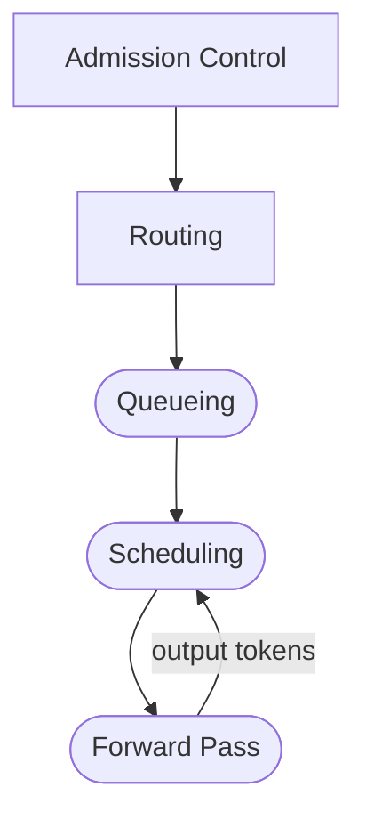

# Why Simulate Before You Scale

Deploying large language models in production is one of the most expensive infrastructure decisions an organization can make. A single high-end GPU costs upwards of $30,000, and a production cluster can run into millions per year. Yet most teams make their first scaling decisions based on rough estimates, vendor benchmarks, or — worst of all — trial and error on live hardware.

What if you could test your deployment plan *before* spending a dollar on GPUs?

<!-- more -->

## The Problem: Scaling Blind

When a team decides to serve an LLM at scale, they face a cascade of interconnected questions:

- **How many GPU instances** do we need for our expected traffic?
- **What happens during a traffic spike**: does latency degrade gracefully, or does the system fall over?
- **Which model fits our hardware budget** while still meeting our latency targets?
- **How should we route requests** across instances to keep response times low?

These questions are deeply intertwined. Changing the number of instances affects routing behavior, which affects queue depths, which affects latency. Traditional back-of-the-envelope math can't capture these dynamics. And running experiments on real GPUs is slow, expensive, and hard to reproduce.

## The Insight: A Flight Simulator for LLM Infrastructure

The aerospace industry doesn't test new wing designs by building full aircraft and hoping for the best. They simulate. The same principle applies to inference infrastructure.

**BLIS** (Blackbox Inference Simulator) is a discrete-event simulator purpose-built for LLM serving systems. It models the full lifecycle of every request, from arrival through routing, queuing, batching, and token generation, and produces the same metrics you'd measure in production: time to first token, inter-token latency, throughput, and KV cache utilization.

The key difference: **it runs on your laptop in seconds, with no GPUs required.** BLIS models the end-to-end journey of every request, as faithfully as possible to real serving systems, from cluster-level routing decisions down to per-token batch scheduling.

*A new request arrives and flows through:*



*Rectangular nodes are cluster-level decisions. Rounded nodes are the per-instance token generation loop.*

**BLIS simulates the physics of this entire pipeline end-to-end.**

## What You Can Do With It

### Plan Capacity With Confidence

Run simulations at different instance counts, GPU configurations, and traffic patterns, including spikes, mixed workloads, and priority classes. BLIS tells you exactly where your latency targets break and how the system degrades, so you provision for reality rather than guesswork. Every simulation is deterministic and reproducible: same inputs, byte-identical results, fully auditable.

### Compare Policies Side by Side

Routing strategies, admission control rules, and scheduling algorithms all interact in non-obvious ways. BLIS lets you swap any of these independently and measure the impact on your actual workload distribution, not a generic benchmark.

### Validate New Algorithms Quickly

Beyond comparing known strategies, BLIS is a testbed for new ones. Designing a novel routing policy or scheduling algorithm? Every policy axis in BLIS is a swappable interface. Plug in your candidate, run it against realistic workloads, and get deterministic results in seconds. No GPU cluster needed, no week-long experiment cycles. BLIS's architecture makes it a natural fit for rapid, iterative algorithm development in the emerging field of [AI-native system design and evolution](https://ucbskyadrs.github.io).

## Why BLIS?

Most inference estimation tools answer a narrow question: "how fast is one forward pass?" BLIS answers the harder one: "how does a cluster of instances behave under realistic traffic?"

**System-level, not just step-level.** Roofline calculators and FLOPs-based estimators give you single-instance step time. That's a useful building block, and BLIS includes roofline estimation as one of its latency backends. But step time alone doesn't tell you what happens when requests queue, batches form dynamically, KV cache fills up and starts evicting, or a routing policy sends too much traffic to one instance. BLIS simulates these interactions together.

**Every policy axis is swappable.** Routing, admission control, scheduling, batch formation, and KV cache management are all independent interfaces. Change one without touching the others. This makes BLIS useful not just for estimation but for *policy comparison*: which routing strategy works best for your specific workload?

**Accuracy across models and hardware.** BLIS ships with three latency backends (trained coefficients, analytical roofline, and physics-informed cross-model prediction), each with different accuracy/generality trade-offs. We'll cover validation methodology and accuracy results in a follow-up post.

## See It in Action

BLIS requires only [Go 1.21+](https://go.dev/dl/) and Git. Clone, build, and run a 4-instance cluster simulation in under a minute:

```bash
git clone https://github.com/inference-sim/inference-sim.git
cd inference-sim
go build -o blis main.go
./blis run --model qwen/qwen2.5-7b-instruct --num-instances 4 --routing-policy weighted
```

BLIS prints per-instance metrics followed by a cluster-level summary. Here's the cluster output from the command above:

```json
{
  "instance_id": "cluster",
  "completed_requests": 100,
  "still_queued": 0,
  "still_running": 0,
  "injected_requests": 100,
  "total_input_tokens": 54508,
  "total_output_tokens": 54017,
  "vllm_estimated_duration_s": 101.359297,
  "responses_per_sec": 0.986589320957899,
  "tokens_per_sec": 532.9259535018283,
  "e2e_mean_ms": 1511.14539,
  "e2e_p90_ms": 2389.8013,
  "e2e_p95_ms": 2666.55615,
  "e2e_p99_ms": 3396.03111,
  "ttft_mean_ms": 11.599950000000002,
  "ttft_p90_ms": 18.8503,
  "ttft_p95_ms": 19.849049999999995,
  "ttft_p99_ms": 21.63142,
  "itl_mean_ms": 2.776062054538386,
  "itl_p90_ms": 2.784,
  "itl_p95_ms": 2.787,
  "itl_p99_ms": 2.791,
  "scheduling_delay_p99_ms": 0,
  "preemption_count": 0,
  "dropped_unservable": 0,
  "length_capped_requests": 0
}
```

The key metrics to look at:

| Metric | Value | What It Tells You |
|--------|-------|-------------------|
| **ttft_p99_ms** | 21.63142 | 99th-percentile time to first token. Are users waiting too long for the first response? |
| **e2e_p99_ms** | 3396.03111 | Tail end-to-end latency. Worst-case total request duration |
| **responses_per_sec** | 0.986589320957899 | Cluster throughput. Is the system keeping up with demand? |
| **preemption_count** | 0 | KV cache evictions. Non-zero means memory pressure is degrading throughput |
| **scheduling_delay_p99_ms** | 0 | Time spent waiting in the queue. High values signal you need more instances |

At the default rate of 1 req/s across 4 instances, this cluster has plenty of headroom: TTFT p99 is under 22ms and no requests are queued or preempted. What happens when you crank the rate to 500 req/s? That's where it gets interesting. Try it:

```bash
./blis run --model qwen/qwen2.5-7b-instruct --num-instances 4 \
  --rate 500 --num-requests 2000 --routing-policy weighted
```

Watch `ttft_p99_ms` and `scheduling_delay_p99_ms` climb as the instances saturate. The [capacity planning tutorial](../../getting-started/tutorial.md) walks through exactly how to find the tipping point and right-size your cluster.

## The Bottom Line

GPU infrastructure is too expensive for guesswork. BLIS gives you a way to explore your deployment design space (model choices, instance counts, routing policies, memory configurations) before committing real resources. The cost of a simulation is measured in seconds of laptop time. The cost of getting it wrong in production is measured in dollars, downtime, and user experience.

See the [installation guide](../../getting-started/installation.md) for prerequisites and build details, or jump straight to the [capacity planning tutorial](../../getting-started/tutorial.md).
