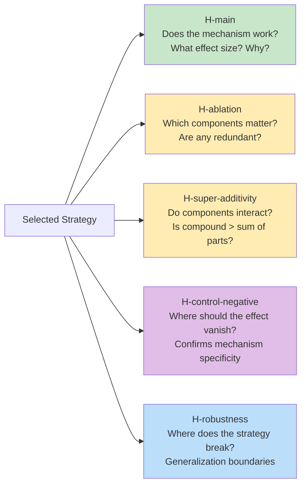
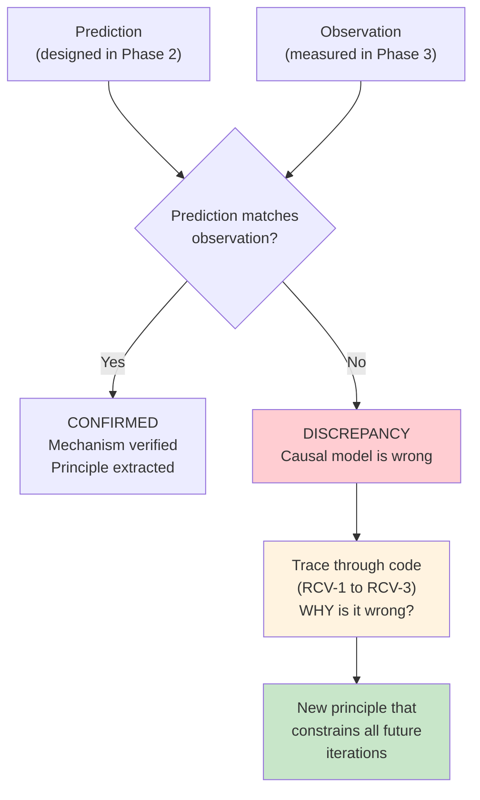

# Hypothesis Bundles in Practice

This page provides detailed examples of hypothesis bundles drawn from real Strategy Evolution experiments. It accompanies the main [Strategy Evolution](strategy-evolution.md) methodology page.

!!! note "Experimental Extensions"
    The examples below describe experimental strategies (SLO-tiered priority, SLO-gated admission, per-SLO prefill thresholds) that were implemented as custom extensions during Strategy Evolution experiments. These are not yet available as standard BLIS policy templates. The examples illustrate the *methodology*, not current BLIS capabilities. See the [Experimental Configurations](strategy-evolution.md#results-how-two-tracks-converged) note for details.

---

## What is a Hypothesis Bundle?

A **hypothesis bundle** replaces the informal strategy description ("try mechanism X with parameters Y") with a falsification framework designed before implementation. It is a set of testable predictions that collectively define a strategy and its validation apparatus.

Every bundle contains up to five canonical arm types. Compound mechanisms use all five; simpler iterations use subsets (see [when to skip](#when-to-skip-the-full-bundle)). Bundles may also include **application-specific arms** beyond the canonical five — for example, H-zero-sum (side-effect detection on a different metric) as shown in the scheduling example below.

Every arm includes three elements:

1. **Quantitative prediction** — a specific metric and threshold (e.g., ">30% TTFT P99 improvement")
2. **Causal mechanism** — WHY the prediction should hold (e.g., "because priority ordering allows critical requests to bypass the queue")
3. **Diagnostic clause** — what a failure would indicate (e.g., "if this fails, priority gaps are insufficient at this load")

---

## Example: Scheduling Track, Iteration 1 (PR #452)

The scheduling track of Strategy Evolution (PR #452, draft) explored SLO-aware scheduling strategies over 11 iterations, achieving -73.7% critical TTFT P99. Here is how iteration 1 — the SLO-tiered priority strategy — would be formulated as a hypothesis bundle.

### The scheduling strategy

SLO-tiered priority with base scores: critical=10, standard=5, sheddable=1. Piecewise-linear urgency thresholds prevent starvation. A priority bridge passes SLO hints from the router to the scheduler.

### The scheduling bundle (designed at Phase 2, before implementation)

#### H-main — scheduling mechanism claim

> "SLO-tiered priority with base scores [critical=10, standard=5, sheddable=1] will reduce critical TTFT P99 by >30% at rate=2000 req/s because priority ordering allows critical requests to be scheduled ahead of lower-priority requests when they contend in the wait queue.
>
> *If this fails, it indicates priority gaps are insufficient to overcome queue depth at this load level.*"

**Experiment design:**

- Treatment: SLO-tiered priority scheduler + priority bridge
- Control: FCFS scheduler (baseline)
- Workload: Orthogonal SLO tiers (identical request shapes, SLO class is only differentiator)
- Rate: 2000 req/s (near saturation)
- Seeds: 42, 123, 456

#### H-ablation-priority — scheduling component isolation

> "Removing priority ordering (reverting to FCFS) while keeping the priority bridge and all other components will degrade critical TTFT P99 by >20%, because priority scheduling is the primary mechanism.
>
> *If degradation is <5%, the improvement comes from the routing bridge, not the scheduler.*"

**Experiment design:**

- Treatment: Full compound strategy
- Control: Same strategy but with FCFS scheduler (priority disabled)
- Vary: Scheduler only (one dimension — ED-1)

#### H-zero-sum — cluster-wide side-effect detection (application-specific arm)

*Note: This arm replaces H-super-additivity for this strategy. The priority bridge is infrastructure (not an independent mechanism), so component interaction testing is less relevant than side-effect detection. H-zero-sum tests whether improving one class harms another — a question specific to priority-based strategies at saturation.*

> "The compound strategy at near-saturation (rate=2000) will NOT degrade cluster-wide TTFT P99 by more than 10%, because priority reordering should primarily benefit critical requests without significantly harming others.
>
> *If cluster P99 degrades >30%, scheduling is zero-sum at saturation — improving one class directly worsens another. A non-zero-sum lever (e.g., admission control) would be needed to break the compute floor.*"

**Experiment design:**

- Treatment: Full compound strategy
- Metric: Both critical-class and cluster-wide TTFT P99
- Rate: Near-saturation (2000 req/s)

#### H-control-negative — scheduling mechanism specificity

> "Applying the strategy to a uniform workload (all requests same SLO class) will produce <5% improvement, confirming the mechanism requires SLO differentiation.
>
> *If improvement exceeds 5%, the mechanism has an SLO-independent component we haven't identified.*"

**Experiment design:**

- Treatment: Full compound strategy
- Workload: All requests labeled `standard` (uniform SLO)
- Expected: Byte-identical or <5% difference from baseline

#### H-robustness — scheduling generalization boundary

> "The strategy maintains >40% critical TTFT improvement when KV blocks decrease from 132K to 3000, because the priority mechanism doesn't depend on KV abundance. Below 3000, degradation is expected as KV contention dominates scheduling order.
>
> *If improvement collapses above 3000 blocks, KV state is confounding the priority mechanism.*"

### What actually happened (and what hypothesis bundles would have caught earlier)

The actual iteration 1 results:

| Metric | Prediction | Outcome | Match? |
|--------|-----------|---------|--------|
| Critical TTFT P99 | >30% improvement | **-50.8%** | Confirmed (exceeded prediction) |
| Cluster TTFT P99 | <10% degradation | **+62.4%** | **Refuted** (zero-sum!) |
| Throughput | <5% change | **~0%** | Confirmed |

The H-zero-sum prediction was **refuted** — cluster P99 degraded 62.4%, far exceeding the predicted <10%. The diagnostic clause ("a non-zero-sum lever is needed") pointed directly to admission control as the solution. Under the old methodology without hypothesis bundles, this zero-sum behavior was an informal surprise that took three iterations and human insight to diagnose. With the bundle, the diagnostic clause would have redirected effort to admission control in iteration 1's FINDINGS analysis.

---

## Example: Routing Track, Iteration 6 (PR #447)

The routing track of Strategy Evolution (PR #447, draft) explored routing scorer optimization over 19 iterations, discovering that KV-utilization as a routing scorer is counterproductive (RP-6). Here is how the iteration that discovered this finding would be formulated.

### The routing strategy

Drop the KV-utilization scorer from the routing pipeline. Use `pa:3,qd:2` instead of `pa:3,qd:2,kv:2`.

### Key routing bundle arms

#### H-main — routing mechanism claim

> "Removing the KV-utilization scorer will improve or maintain TTFT P99 compared to the full `pa:3,qd:2,kv:2` configuration, because the `1-KVUtilization` formula routes away from instances with high occupancy — which are often the instances with the most valuable cached prefixes (in prefix-heavy workloads). Under memory pressure, this anti-correlation is especially harmful.
>
> *If removing kv-util degrades performance, cache affinity and memory pressure are not correlated in this workload.*"

#### H-ablation-kv — routing signal isolation

> "Under KV pressure (reduced blocks), the `pa:3,qd:2` configuration will improve by >10% over `pa:3,qd:2,kv:2`, because KV-utilization penalizes the instances with the best cache locality.
>
> *If <5% difference under pressure, KV-util's routing harm is negligible even in the regime where it's theoretically worst.*"

#### H-control-negative — routing regime where kv-util should help

> "Under abundant KV blocks (default 132K), removing kv-util will produce <5% difference, because with abundant memory the signal is degenerate (all instances have low KV utilization).
>
> *If >5% improvement even with abundant blocks, kv-util is harmful in ALL regimes, not just under pressure.*"

### What this routing bundle would have revealed

The actual routing track results showed:

- Removing kv-util improved performance by **4% even with abundant blocks**
- Under KV pressure, the improvement was **23-25%**
- The H-control-negative was borderline (4% is below the 5% threshold, so formally the control passed). However, the direction of improvement — positive even with abundant blocks — suggested regime-independent harm that warranted investigation

Combined with the KV-pressure results (23-25%), this led to principle RP-6: "KV-utilization as a routing scorer is counterproductive under memory pressure." The consistent direction of improvement across regimes additionally suggested this should be a universal recommendation.

---

## Why Prediction Errors Matter

The hypothesis bundle's most powerful feature is not confirming that strategies work — it's **diagnosing why predictions fail.**

Three categories of prediction error, each with different learning value:

| Error type | What it reveals | Example |
|-----------|----------------|---------|
| **Direction wrong** | Fundamental misunderstanding of mechanism | Predicted improvement, got degradation → mechanism is counterproductive |
| **Magnitude wrong** | Correct mechanism, wrong model of strength | Predicted <10% degradation, got +62% → underestimated zero-sum effect |
| **Regime wrong** | Mechanism works but in different conditions | Predicted improvement at all loads, only works under saturation → effect is load-dependent |

In the scheduling track, the key breakthroughs came from prediction errors:

1. **Iteration 1:** H-zero-sum predicted <10% cluster degradation. Observed +62.4%. Error revealed S6 (scheduling is zero-sum at saturation) → redirected to admission control.

2. **Iteration 3:** H-main predicted admission gating would break the "compute floor" established in iteration 1-opt. Confirmed: critical TTFT dropped from 132ms to 107ms. The prediction-vs-outcome framework made this a **testable claim** rather than an informal hope.

3. **Iteration 4:** Ablation predicted disabling chunked prefill for the critical class would save overhead from eliminated chunk boundaries (principle S9: "Disabling chunking for critical saves 14ms of beta0 overhead"). Confirmed — critical TTFT dropped from 132ms to 90ms.

---

## Bundle Size Guide

The number of hypothesis arms scales with strategy complexity. Use this table as a planning guide:

| Components | Typical arms | Breakdown |
|-----------|------|---------|
| 1 | 4-5 | H-main, H-control-negative, 2-3 H-robustness |
| 2 | 6-7 | H-main, 2 H-ablation, H-super-additivity, H-control-negative, 1-2 H-robustness |
| 3 | 7-9 | H-main, 3 H-ablation, H-super-additivity, H-control-negative, 1-2 H-robustness |
| 4 | 9-11 | H-main, 4 H-ablation, H-super-additivity, H-control-negative, 2-3 H-robustness |

### Managing bundle cost

1. **Tiered review depth:**

    | Arm type | FINDINGS Review | Rationale |
    |----------|----------------|-----------|
    | H-main | Full 10-perspective | Core claim — needs maximum scrutiny |
    | H-ablation, H-super-additivity | 5-perspective | Simpler experiments, fewer confounds |
    | H-control-negative (byte-identical) | Spot-check that treatment was active, then automatic validation | Verify the treatment was correctly applied; byte-identical output confirms specificity |
    | H-robustness | 5-perspective | Standard experimental rigor |

2. **Parallel execution.** All arms are independent. Use the [parallel execution mode](../contributing/hypothesis.md#parallel-execution-mode) from the hypothesis process. All arms in a bundle must use the same seed set for valid comparison.

3. **Fast-fail.** If H-main is refuted (after FINDINGS review confirms the refutation is genuine, not an analyzer bug), skip remaining arms. If H-control-negative fails, stop and redesign. See [fast-fail rules](strategy-evolution.md#fast-fail-rules).

### When to skip the full bundle

Not every iteration needs every arm:

| Iteration type | Required arms | Optional |
|---|---|---|
| New compound mechanism (≥2 components) | H-main, all H-ablation, H-super-additivity, H-control-negative | H-robustness |
| Component removal/simplification | H-main, H-control-negative, H-ablation for removed component | H-robustness |
| Single-component mechanism | H-main, H-control-negative | H-robustness |
| Parameter-only change (same active components, only numeric values change) | H-main only | Proceed directly to Bayesian optimization |
| Robustness sweep (post-confirmation) | H-robustness arms only | — |

---

## Writing Good Hypothesis Arms

### The three elements

Every hypothesis arm needs:

1. **A quantitative prediction with a threshold.** Not "should improve" but ">30% TTFT P99 improvement." The threshold makes the prediction falsifiable. A prediction is **confirmed** if the observed effect matches the predicted direction AND exceeds the stated threshold. It is **partially confirmed** if the direction is correct but magnitude falls short. It is **refuted** if the direction is wrong or the magnitude is negligible (<5%).

2. **A causal mechanism.** Not "because it's better" but "because priority ordering allows critical requests to bypass the queue when they contend with lower-priority requests." The mechanism makes the prediction diagnostic.

3. **A diagnostic clause.** Not "if it fails, something is wrong" but "if this fails, priority gaps are insufficient to overcome queue depth at this load." The clause directs investigation when the prediction errors.

### Common mistakes

| Mistake | Problem | Fix |
|---------|---------|-----|
| Vague prediction | "Should improve TTFT" | Specify metric + direction + threshold: ">30% TTFT P99 improvement" |
| No mechanism | "Because it's a better strategy" | Explain the causal chain: "because X causes Y which reduces Z" |
| No diagnostic | "If it fails, try something else" | Direct investigation: "if it fails, it indicates X, investigate Y" |
| Prediction too conservative | "Will produce >0% improvement" | Unfalsifiable — any positive change confirms. Use meaningful thresholds from first principles. |
| Missing control | Testing compound without isolating components | Add H-ablation for each component and H-control-negative |
