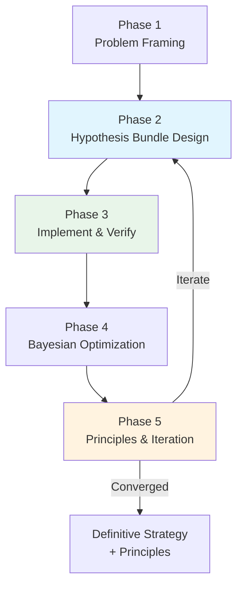
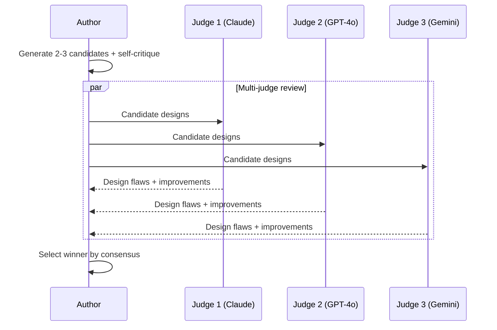
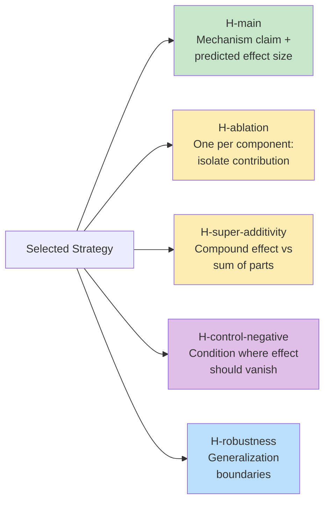
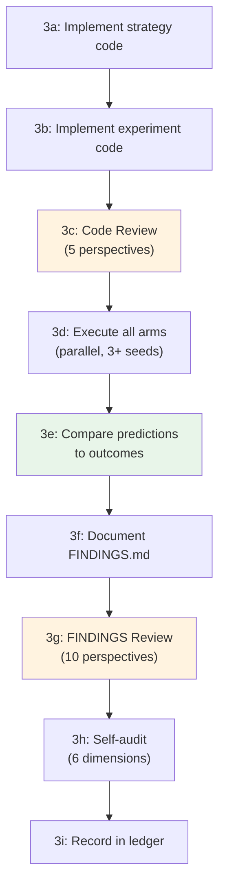
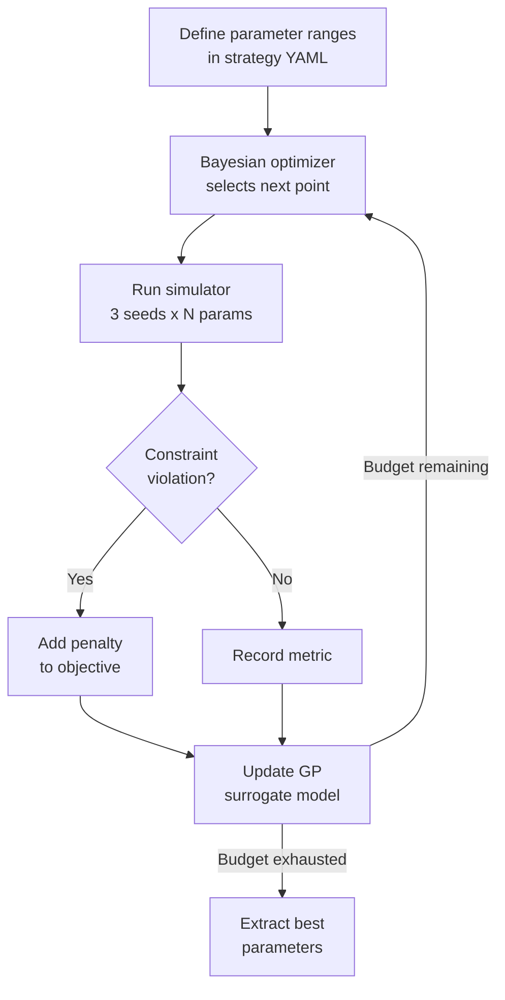
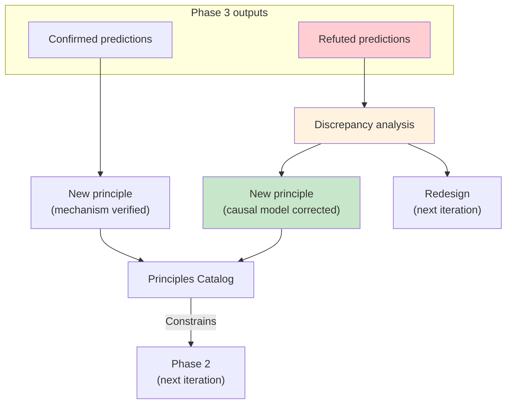

# Strategy Evolution

A structured, iterative search methodology for discovering high-performing system configurations in complex, multi-dimensional policy spaces. The methodology structure is domain-agnostic; the specific instantiation described here was developed for LLM inference serving using BLIS.

---

## Overview

In systems with multiple interacting policy layers — routing, scheduling, memory management, admission control — the optimal configuration cannot be derived analytically or guessed by experts. Interactions between layers produce non-obvious emergent behaviors: super-additive effects, signal cancellation, and regime-dependent dominance.

Strategy Evolution discovers optimal configurations through disciplined experimentation: human-guided mechanism design combined with machine-guided parameter optimization, organized into iterative cycles with rigorous measurement and cumulative principle extraction.

The central idea: **a strategy is a hypothesis bundle.** Every candidate mechanism is formulated as a set of testable predictions — a main hypothesis, ablation hypotheses, controls, and robustness checks — all designed before any code is written. Prediction errors, not just fitness scores, are the primary signal for learning.



For detailed examples of hypothesis bundles drawn from PR #452 and PR #447, see **[Hypothesis Bundles in Practice](hypothesis-bundles.md)**.

---

## Phase 1: Problem Framing

Write a precise problem statement (`problem.md`) that specifies:

- **The baseline to beat** — exact configuration parameters, measured across 3+ seeds
- **The target workload** — designed to prevent shortcutting (see below)
- **Quantitative success criteria** — e.g., ">15% TTFT P99 improvement, >5% throughput improvement"
- **Hard constraints** — must be implementable, defensible to domain experts, robust across seeds
- **Prior knowledge inventory** — experimental findings that narrow the design space

!!! tip "Workload Design is Critical"
    Design the workload to prevent strategies from gaming the metric. In our work, we used **orthogonal SLO tiers** — all tiers share identical request shapes, so strategies cannot use token-length as a proxy for priority. The SLO class metadata is the *only* differentiator.

**Artifacts produced:** `problem.md`, `baseline.json`

---

## Phase 2: Hypothesis Bundle Design

Phase 2 is the heart of Strategy Evolution. Each iteration generates candidate strategies and formulates the winner as a **hypothesis bundle** — a set of testable predictions designed before any code is written.

### Step 2a: Generate and review candidates

Generate 2–3 candidate strategies. Each must be:

1. **A parameterized template** — the mechanism defines *what* the strategy does; tunable parameters control *how aggressively*
2. **Self-critiqued** — identify weaknesses before external review
3. **Reviewed by multiple independent judges** — we used Claude Opus, GPT-4o, and Gemini 2.5 Flash



!!! example "Multi-Judge Catches Real Design Flaws"
    - **Claude Opus** identified that a proposed cache score (`1 - KVUtilization`) was a free-capacity signal, not a cache-affinity signal — a subtle conflation that would have wasted an entire iteration
    - **GPT-4o** caught a bang-bang oscillation problem in an online learning controller
    - **Gemini** caught a numerical instability in hyperbolic starvation protection

### Step 2b: Decompose winner into hypothesis bundle

After selecting the winning strategy, decompose it into a **hypothesis bundle** — a set of testable, falsifiable predictions:



| Arm | What it tests | Purpose |
|-----|--------------|---------|
| **H-main** | Mechanism's predicted effect + causal explanation | Does the strategy work, and *why*? |
| **H-ablation-{component}** | Each component's individual contribution | Which parts matter? Are any redundant? |
| **H-super-additivity** | Whether compound effect exceeds sum of parts | Do components interact? |
| **H-control-negative** | Where the effect should vanish | Confirms mechanism specificity |
| **H-robustness** | Generalization across workloads, resources, scale | Where does the strategy break? |

Each arm follows the [hypothesis experiment workflow](../contributing/hypothesis.md): experiment design standards (ED-1 through ED-6), convergence-gated review, formal controls, FINDINGS documentation. Every arm includes a **diagnostic clause** ("if this fails, it indicates...") that directs investigation when predictions don't match outcomes.

!!! warning "Pre-commit ablation, don't bolt it on"
    Ablation hypotheses are designed HERE, before any code is written. This prevents confirmation bias — you predict each component's contribution before seeing whether the compound strategy works. If you can't articulate what removing a component should do, you don't understand the mechanism well enough to implement it.

For a complete worked example of a hypothesis bundle, see **[Hypothesis Bundles in Practice — Scheduling Example](hypothesis-bundles.md#example-scheduling-track-iteration-1-pr-452)**.

### Step 2c: Design Review

Run the **5-perspective Design Review** on the hypothesis bundle using the [universal convergence protocol](../contributing/convergence.md).

```
/convergence-review h-design
```

The review covers the full bundle — not just H-main, but all ablation, control, and robustness arms.

### Step 2d: Human approval gate

Present the hypothesis bundle for human approval. The human reviews: H-main predictions, ablation predictions, control designs, and robustness boundaries.

**This is a hard gate.** Do not proceed to implementation until the human approves.

**Artifacts produced:** `research.md`, `iter<N>-bundle.yaml`, Design Review convergence log

---

## Phase 3: Implement and Verify

Implement the strategy code AND the experiment code for the full hypothesis bundle, then execute, analyze, and review — all before moving to parameter optimization.



**3a — Implement strategy.** New policy code, CLI flags, or configuration.

**3b — Implement experiments.** For each hypothesis arm, create `run.sh` (sources shared harness) and `analyze.py`. All arms share one `run.sh` — they are independent and can execute in parallel.

**3c — Code Review.** 5-perspective review on all experiment code BEFORE running experiments (`/convergence-review h-code`).

**3d — Execute.** Run all hypothesis arms across 3+ seeds.

**3e — Compare predictions to outcomes.** For each arm, record:

- What was **predicted** (from the bundle design in Phase 2)
- What was **observed** (from the experiment)
- Whether the prediction was **confirmed** (direction correct AND exceeds threshold), **partially confirmed** (direction correct, magnitude falls short), or **refuted** (direction wrong or magnitude negligible <5%)
- If refuted: what the **discrepancy reveals** about the causal model

**3f — Document FINDINGS.** Write `FINDINGS.md` using the [hypothesis template](../contributing/templates/hypothesis.md). The prediction-vs-outcome comparison is a required section.

**3g — FINDINGS Review.** 10-perspective review using the [convergence protocol](../contributing/convergence.md) (`/convergence-review h-findings`).

**3h — Self-audit.** Six dimensions of critical self-review.

**3i — Record in ledger.** One row per iteration, including prediction accuracy.

!!! warning "The Ledger is the Single Source of Truth"
    Never delete rows. Failed approaches are as valuable as successes. The ledger prevents revisiting failed approaches and makes the full exploration path auditable.

**Extended ledger format:**

| Iter | Strategy | TTFT P99 Δ% | Throughput Δ% | Key Mechanism | Prediction Accuracy | Status |
|------|----------|-------------|---------------|---------------|-------------------|--------|
| 0 | Baseline | — | — | FCFS + constant priority | — | Measured |
| 1 | SLO-Gated Priority | -50.8% | ~0% | Priority cascade | H-main confirmed; H-zero-sum refuted (zero-sum) | Bundle verified |

**Artifacts produced:** `ledger.md`, `iter<N>-FINDINGS.md`, convergence logs

---

## Phase 4: Bayesian Parameter Optimization

Once a mechanism's H-main is **confirmed** in Phase 3, optimize its parameters. Mechanisms whose H-main was refuted skip this phase — their prediction errors are analyzed for principles instead.



This separates **mechanism design** (human creativity + hypothesis testing) from **parameter tuning** (machine search). Every strategy gets the benefit of optimization, so comparisons are fair.

**Strategy YAML format:**

```yaml
name: "slo-gated-priority-cascade"
parameters:
  - name: "base_critical"
    flag: "--slo-base-critical"
    type: "real"
    low: 5.0
    high: 20.0
  - name: "age_weight"
    flag: "--slo-age-weight"
    type: "real"
    low: 0.000001
    high: 0.0001
    prior: "log-uniform"
objective:
  metric: "ttft_p99_ms"
  direction: "min"
constraints:
  - metric: "throughput_tps"
    direction: "max"
    threshold: 15000
    weight: 10
```

**Budget:** 30–50 evaluations × 3 seeds = 90–150 simulator runs per strategy.

**Artifacts produced:** `optimize.py`, `*-optimization-results.json`

---

## Phase 5: Principle Extraction and Iteration

Extract principles from the iteration's results and decide whether to iterate.

### Principle extraction

Distill findings into **numbered principles** — concise, falsifiable statements grounded in experimental evidence. Principles come from two sources:

1. **Confirmed predictions** — the mechanism works as theorized (e.g., RP-1: "Orthogonal signals > pre-combined signals")
2. **Prediction errors** — the most valuable source. When a prediction fails, the discrepancy reveals something about the system that wasn't understood (e.g., S6: "Scheduling is zero-sum at saturation")



Principles function as **hard constraints** on subsequent iterations:

- **RP-1** (orthogonality) prevented building a combined cache-load scorer in iterations 5–19
- **RP-6** (KV-util counterproductive) eliminated KV-utilization from all subsequent strategies
- **S6** (scheduling is zero-sum) redirected effort from scheduler optimization to admission control
- **RP-10** (PA:QD safety rule) prevented ratio violations in Bayesian search bounds

When a new iteration proposes a mechanism that contradicts an existing principle, it must either provide experimental evidence that the principle doesn't hold in the new regime, or redesign to work within the principle's constraints.

### Fast-fail rules

| Condition | Action |
|-----------|--------|
| **H-main refuted** | H-main refutation still requires a minimum 5-perspective FINDINGS Review to confirm the refutation is genuine (not an analyzer bug). After verification, skip ablation arms. Record refutation + diagnostic. Iterate. |
| **H-main confirmed, single dominant component (>80% of effect)** | Simplify strategy to that component. Iterate. |
| **H-control-negative fails** (effect appears when it shouldn't) | Mechanism is confounded. Redesign before continuing. |

### Stopping criterion

Stop when multiple consecutive iterations produce null or marginal results — you have found the basin of the optimal strategy. The [principles catalog](principles.md) is the durable output.

---

## Practical Considerations

### Bundle size management

The number of hypothesis arms scales with strategy complexity (see the [Bundle Size Guide](hypothesis-bundles.md#bundle-size-guide) for detailed breakdowns). Three mitigations keep this manageable:

1. **Tiered review depth.** H-main gets the full 10-perspective FINDINGS review. Ablation arms get a 5-perspective review. Byte-identical controls get a spot-check that the treatment was active, then automatic validation.

2. **Parallel execution.** Hypothesis arms are independent. Use [parallel execution mode](../contributing/hypothesis.md#parallel-execution-mode). All arms must use the same seed set for valid comparison.

3. **Fast-fail.** If H-main is refuted (after FINDINGS review confirms the refutation), skip remaining arms.

### When to use the full bundle vs. a lighter iteration

| Iteration type | Required arms | Optional arms |
|---|---|---|
| New compound mechanism (≥2 components) | H-main, all H-ablation, H-super-additivity, H-control-negative | H-robustness |
| Component removal/simplification | H-main, H-control-negative, H-ablation for removed component | H-robustness |
| Single-component mechanism | H-main, H-control-negative | H-robustness |
| Parameter-only change (same active components, only numeric values change) | H-main only | Proceed directly to Bayesian optimization |
| Robustness sweep (post-confirmation) | H-robustness arms only | — |

### How Strategy Evolution connects to existing workflows

| Skill / Process | Role in Strategy Evolution |
|---|---|
| `/research-ideas` | Generates candidate strategies (Step 2a) |
| `/hypothesis-experiment` | Guided Steps 0-10 experiment workflow (project skill) |
| `/hypothesis-test` | Experiment scaffolding: run.sh, analyze.py templates (sdlc-plugins) |
| `/convergence-review` | Gates Design Review, Code Review, FINDINGS Review |
| `/brainstorming` | Explores solution space before committing to candidates |
| [Hypothesis experiment process](../contributing/hypothesis.md) | Defines the detailed per-arm workflow |

---

## Skills and Tools Inventory

| Skill | Phase | Purpose |
|-------|-------|---------|
| `/research-ideas` | 2a | Structured idea generation with iterative external LLM review |
| `/brainstorming` | 2a | Explore solution space before committing to an approach |
| `/review-plan` | 2a | Send candidate designs to external LLMs for technical review |
| `/convergence-review` (h-design) | 2c | 5-perspective design review on hypothesis bundle |
| `/hypothesis-experiment` | 3b | Guided Steps 0-10 experiment workflow (project skill) |
| `/hypothesis-test` | 3b | Experiment scaffolding: run.sh, analyze.py templates (sdlc-plugins) |
| `/test-driven-development` | 3a | TDD for new policy implementations |
| `/convergence-review` (h-code) | 3c | 5-perspective code review on experiment code |
| `/convergence-review` (h-findings) | 3g | 10-perspective findings review |
| `/verification-before-completion` | 3h | Confirm results before claiming success |
| `/dispatching-parallel-agents` | 3d | Parallel hypothesis arm execution |
| `/commit-push-pr` | 5 | Clean git integration after validation |

!!! info "Where to Get These Skills"
    These skills are [Claude Code](https://docs.anthropic.com/en/docs/claude-code) plugins. To install them:

    - **`/brainstorming`, `/test-driven-development`, `/verification-before-completion`, `/dispatching-parallel-agents`, `/commit-push-pr`**: Install the [superpowers](https://github.com/anthropics/claude-code-plugins) plugin — `claude plugins add superpowers`
    - **`/convergence-review`, `/hypothesis-experiment`**: Project-local skills defined in this repository's `.claude/skills/` directory. Available automatically when Claude Code is run from the repo root.
    - **`/hypothesis-test`**: Install the [sdlc-plugins](https://github.com/inference-sim/sdlc-plugins) plugin — `claude plugins add sdlc-plugins`
    - **`/research-ideas`, `/review-plan`**: Install the [research-ideas](https://github.com/anthropics/claude-code-plugins) plugin — `claude plugins add research-ideas`

**Non-skill tools:**

| Tool | Phase | Purpose |
|------|-------|---------|
| `optimize.py` + scikit-optimize | 4 | Bayesian optimization harness (`gp_minimize`) |
| `strategy_template.yaml` | 4 | Parameterized strategy configuration format |
| `ledger.md` | All | Single source of truth (1 row per iteration, with prediction accuracy) |
| Git worktrees | All | Isolation per experiment track |

---

## Applying to a New Problem

1. **Write `problem.md`** — baseline, workload, success criteria, constraints, prior knowledge. Design the workload to prevent shortcutting.

2. **Build the measurement harness** — deterministic simulator or benchmark that accepts parameterized configuration, produces machine-parseable metrics, and runs fast enough for 100–200 evaluations. For noisy real-system benchmarks, increase seed count and evaluation budget proportionally.

3. **Start the ledger** — `ledger.md` with baseline row. One row per iteration with a prediction accuracy column. Never delete rows.

4. **Run the loop** — for each iteration:
    - Generate 2-3 candidates with multi-judge review (Phase 2a)
    - Decompose winner into a hypothesis bundle with predictions, ablation, controls, and robustness checks (Phase 2b)
    - Convergence-gated Design Review + human approval (Phase 2c-2d)
    - Implement strategy + experiments, Code Review, execute all arms, compare predictions to outcomes, FINDINGS Review (Phase 3)
    - Bayesian optimization for confirmed mechanisms (Phase 4)
    - Extract principles from both confirmed predictions and prediction errors (Phase 5)

5. **Know when to stop** — when multiple consecutive iterations produce null or marginal results, you have found the basin of the optimal strategy. The [principles catalog](principles.md) is the durable output.

---

## Results: How Two Tracks Converged

Strategy Evolution was applied in parallel on two complementary problem spaces:

| Dimension | Scheduling Track (11 iters) | Routing Track (19 iters) |
|-----------|---------------------------|------------------------|
| Primary lever | Priority ordering + admission control | Scorer weights + signal selection |
| Best result | 73.7% critical TTFT improvement | 65% combined improvement (bursty) |
| Key discovery | Priority is zero-sum; admission is non-zero-sum | KV-utilization scorer is counterproductive |
| Winning strategy | SLO-tiered priority + no-chunk prefill | `pa:4,qd:3` + SLO-gated admission |

Both tracks converged on **SLO-gated admission control as the breakthrough "third lever"** and on `prefix-affinity` + `queue-depth` as the optimal signal pair.

```mermaid
gantt
    title Two-Track Convergence Timeline
    dateFormat X
    axisFormat %s
    section Scheduling Track
    Baseline + SLO priority     :s1, 0, 2
    Bayesian optimization       :s2, 2, 3
    Admission control discovery :crit, s3, 3, 5
    Prefill threshold tuning    :s4, 5, 7
    Robustness + multi-turn     :s5, 7, 11
    section Routing Track
    P2C + dynamic weights       :r1, 0, 3
    Signal orthogonality        :r2, 3, 5
    KV-util counterproductive   :crit, r3, 5, 8
    Compound + admission        :crit, r4, 8, 14
    Bayesian + scaling sweep    :r5, 14, 19
    section Convergence
    Both discover admission ctrl :milestone, 10, 10
    Both drop kv-utilization     :milestone, 12, 12
```



!!! note "Experimental Configurations"
    The winning strategies described above were discovered during Strategy Evolution experiments using custom configurations. Some components (SLO-gated admission, SLO-tiered priority as compound strategies) are not yet available as standard BLIS policy templates. The current BLIS default (`pa:3,qd:2,kv:2`) is maintained for llm-d parity. The regime-dependent recommendation (normal KV: `pa:3,qd:2,kv:2`; under pressure: `pa:3,qd:2`; high load with admission: `pa:4,qd:3`) will be documented in the [principles catalog](principles.md) (currently in draft).
