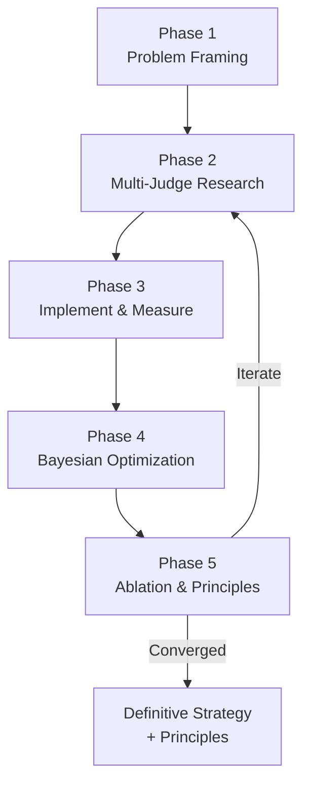
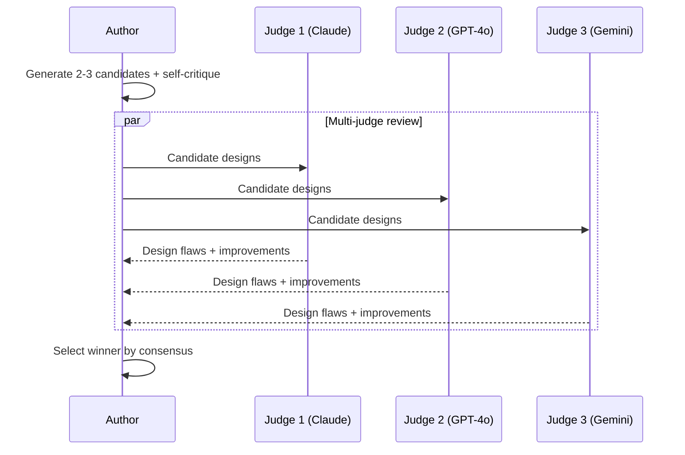
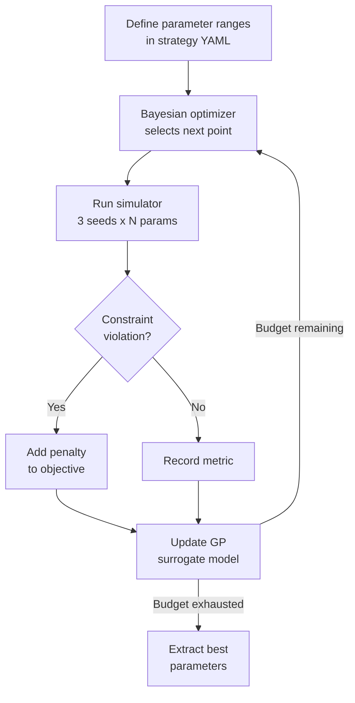

# Strategy Evolution

A structured, iterative search methodology for discovering high-performing system configurations in complex, multi-dimensional policy spaces. The methodology structure is domain-agnostic; the specific instantiation described here was developed for LLM inference serving using BLIS.

---

## Overview

In systems with multiple interacting policy layers — routing, scheduling, memory management, admission control — the optimal configuration cannot be derived analytically or guessed by experts. Interactions between layers produce non-obvious emergent behaviors: super-additive effects, signal cancellation, and regime-dependent dominance.

Strategy Evolution discovers optimal configurations through disciplined experimentation: human-guided mechanism design combined with machine-guided parameter optimization, organized into iterative cycles with rigorous measurement and cumulative principle extraction.



---

## Phase 1: Problem Framing

Write a precise problem statement (`problem.md`) that specifies:

- **The baseline to beat** — exact configuration parameters, measured across 3+ seeds
- **The target workload** — designed to prevent shortcutting (see below)
- **Quantitative success criteria** — e.g., ">15% TTFT P99 improvement, >5% throughput improvement"
- **Hard constraints** — must be implementable, defensible to domain experts, robust across seeds
- **Prior knowledge inventory** — experimental findings that narrow the design space

!!! tip "Workload Design is Critical"
    Design the workload to prevent strategies from gaming the metric. In our work, we used **orthogonal SLO tiers** — all tiers share identical request shapes, so strategies cannot use token-length as a proxy for priority. The SLO class metadata is the *only* differentiator.

**Artifacts produced:** `problem.md`, `baseline.json`

---

## Phase 2: Multi-Judge Research

For each iteration, generate 2–3 candidate strategies. Each must be:

1. **A parameterized template** — the mechanism defines *what* the strategy does; tunable parameters control *how aggressively*
2. **Self-critiqued** — identify weaknesses before external review
3. **Reviewed by multiple independent judges** — we used Claude Opus, GPT-4o, and Gemini 2.5 Flash



!!! example "Multi-Judge Catches Real Design Flaws"
    - **Claude Opus** identified that a proposed cache score (`1 - KVUtilization`) was a free-capacity signal, not a cache-affinity signal — a subtle conflation that would have wasted an entire iteration
    - **GPT-4o** caught a bang-bang oscillation problem in an online learning controller
    - **Gemini** caught a numerical instability in hyperbolic starvation protection

**Artifacts produced:** `research.md`, `iter<N>-strategy.yaml`

---

## Phase 3: Implement and Measure

Each iteration follows a tight loop:

1. **Implement** the strategy (new policy code, CLI flags, or configuration)
2. **Run** the simulator across 3+ random seeds
3. **Measure** primary and secondary metrics
4. **Record** results in the **ledger** — one row per iteration
5. **Write findings** documenting what worked, what didn't, and opportunities

!!! warning "The Ledger is the Single Source of Truth"
    Never delete rows. Failed approaches are as valuable as successes. The ledger prevents revisiting failed approaches and makes the full exploration path auditable.

**Ledger format:**

| Iter | Strategy | TTFT P99 Δ% | Throughput Δ% | Key Mechanism | Status |
|------|----------|-------------|---------------|---------------|--------|
| 0 | Baseline | — | — | FCFS + constant priority | Measured |
| 1 | SLO-Gated Priority | -50.8% | ~0% | Priority cascade + bridge | Default params |
| 1-opt | (Bayesian optimized) | -51.0% | ~0% | Same, optimized params | Compute floor |

**Artifacts produced:** `ledger.md`, `iter<N>-findings.md`

---

## Phase 4: Bayesian Parameter Optimization

Once a mechanism proves directionally correct, optimize its parameters:



This separates **mechanism design** (human creativity) from **parameter tuning** (machine search). Every strategy gets the benefit of optimization, so comparisons are fair.

**Strategy YAML format:**

```yaml
name: "slo-gated-priority-cascade"
parameters:
  - name: "base_critical"
    flag: "--slo-base-critical"
    type: "real"
    low: 5.0
    high: 20.0
  - name: "age_weight"
    flag: "--slo-age-weight"
    type: "real"
    low: 0.000001
    high: 0.0001
    prior: "log-uniform"
objective:
  metric: "ttft_p99_ms"
  direction: "min"
constraints:
  - metric: "throughput_tps"
    direction: "max"
    threshold: 15000
    weight: 10
```

**Budget:** 30–50 evaluations × 3 seeds = 90–150 simulator runs per strategy.

**Artifacts produced:** `optimize.py`, `*-optimization-results.json`

---

## Phase 5: Ablation, Robustness, and Principle Extraction

Stress-test winning strategies:

- **Workload robustness** — non-orthogonal SLO distributions, asymmetric traffic mixes, multi-prefix groups, multi-turn sessions
- **Resource pressure** — reduced KV cache blocks, CPU offloading, instance scaling (4/8/16)
- **Arrival patterns** — Poisson vs bursty Gamma, rate sweeps from sub-saturation to overload
- **Ablation** — remove each component individually to quantify contribution and test for super-additivity

Every few iterations, distill findings into **numbered principles** — concise, falsifiable statements grounded in experimental evidence. These constrain future iterations and prevent re-learning the same lessons.

A principles catalog documenting findings from the BLIS strategy evolution experiments is planned for a future release.

---

## Skills and Tools Inventory

The following Claude Code skills were used throughout the process:

| Skill | Phase | Purpose |
|-------|-------|---------|
| `/research-ideas` | 2 | Structured idea generation with iterative external LLM review |
| `/brainstorming` | 2 | Explore solution space before committing to an approach |
| `/convergence-review` (design gate) | 2 | Multi-perspective design review (5 judges) |
| `/convergence-review` (h-findings gate) | 5 | Multi-perspective findings review (10 judges) |
| `/review-plan` | 2, 3 | Send plans to external LLMs for technical review |
| `/hypothesis-experiment` | 3 | Structured experiment: scaffold → run → analyze → findings |
| `/test-driven-development` | 3 | TDD for new policy implementations |
| `/executing-plans` | 3 | Step-by-step implementation with review gates |
| `/verification-before-completion` | 3, 5 | Confirm results before claiming success |
| `/code-review` | 5 | Post-implementation quality audit |
| `/commit-push-pr` | 5 | Clean git integration after validation |
| `/dispatching-parallel-agents` | 3 | Parallel hypothesis execution across tracks |

!!! info "Where to Get These Skills"
    These skills are [Claude Code](https://docs.anthropic.com/en/docs/claude-code) plugins. To install them:

    - **`/brainstorming`, `/test-driven-development`, `/executing-plans`, `/verification-before-completion`, `/dispatching-parallel-agents`, `/code-review`, `/commit-push-pr`**: Install the [superpowers](https://github.com/anthropics/claude-code-plugins) plugin — `claude plugins add superpowers`
    - **`/convergence-review`, `/hypothesis-experiment`**: Project-local skills defined in this repository's `.claude/skills/` directory. Available automatically when Claude Code is run from the repo root.
    - **`/research-ideas`, `/review-plan`**: Install the [research-ideas](https://github.com/anthropics/claude-code-plugins) plugin — `claude plugins add research-ideas`
    - **`/pr-review-toolkit:review-pr`**: Install the [pr-review-toolkit](https://github.com/anthropics/claude-code-plugins) plugin — `claude plugins add pr-review-toolkit`

**Non-skill tools:**

| Tool | Phase | Purpose |
|------|-------|---------|
| `optimize.py` + scikit-optimize | 4 | Bayesian optimization harness (`gp_minimize`) |
| `strategy_template.yaml` | 4 | Parameterized strategy configuration format |
| `ledger.md` | All | Single source of truth (1 row per iteration) |
| Git worktrees | All | Isolation per experiment track |

---

## Applying to a New Problem

1. **Write `problem.md`** — baseline, workload, success criteria, constraints, prior knowledge. Design the workload to prevent shortcutting.

2. **Build the measurement harness** — deterministic simulator or benchmark that accepts parameterized configuration, produces machine-parseable metrics, and runs fast enough for 100–200 evaluations.

3. **Start the ledger** — `ledger.md` with baseline row. One row per iteration. Never delete rows.

4. **Run the loop** — Research → Select → Implement → Measure → Record → Optimize → Ablate → Principles → Repeat.

5. **Know when to stop** — when multiple consecutive iterations produce null or marginal results, you have found the basin of the optimal strategy.

---

## Results: How Two Tracks Converged

Strategy Evolution was applied in parallel on two complementary problem spaces:

| Dimension | Scheduling Track (11 iters) | Routing Track (19 iters) |
|-----------|---------------------------|------------------------|
| Primary lever | Priority ordering + admission control | Scorer weights + signal selection |
| Best result | 73.7% critical TTFT improvement | 65% combined improvement (bursty) |
| Key discovery | Priority is zero-sum; admission is non-zero-sum | KV-utilization scorer is counterproductive |
| Winning strategy | SLO-tiered priority + no-chunk prefill | `pa:4,qd:3` + SLO-gated admission |

Both tracks independently discovered that **SLO-gated admission control is the breakthrough "third lever"** and converged on `prefix-affinity` + `queue-depth` as the optimal signal pair.



```mermaid
gantt
    title Two-Track Convergence Timeline
    dateFormat X
    axisFormat %s
    section Scheduling Track
    Baseline + SLO priority     :s1, 0, 2
    Bayesian optimization       :s2, 2, 3
    Admission control discovery :crit, s3, 3, 5
    Prefill threshold tuning    :s4, 5, 7
    Robustness + multi-turn     :s5, 7, 11
    section Routing Track
    P2C + dynamic weights       :r1, 0, 3
    Signal orthogonality        :r2, 3, 5
    KV-util counterproductive   :crit, r3, 5, 8
    Compound + admission        :crit, r4, 8, 14
    Bayesian + scaling sweep    :r5, 14, 19
    section Convergence
    Both discover admission ctrl :milestone, 10, 10
    Both drop kv-utilization     :milestone, 12, 12
```

!!! note "Experimental Configurations"
    The winning strategies described above were discovered during Strategy Evolution experiments using custom configurations. Some components (SLO-gated admission, SLO-tiered priority as compound strategies) are not yet available as standard BLIS policy templates. The current BLIS default (`pa:3,qd:2,kv:2`) is maintained for llm-d parity. The regime-dependent recommendation (normal KV: `pa:3,qd:2,kv:2`; under pressure: `pa:3,qd:2`; high load with admission: `pa:4,qd:3`) will be documented in the forthcoming principles catalog.
