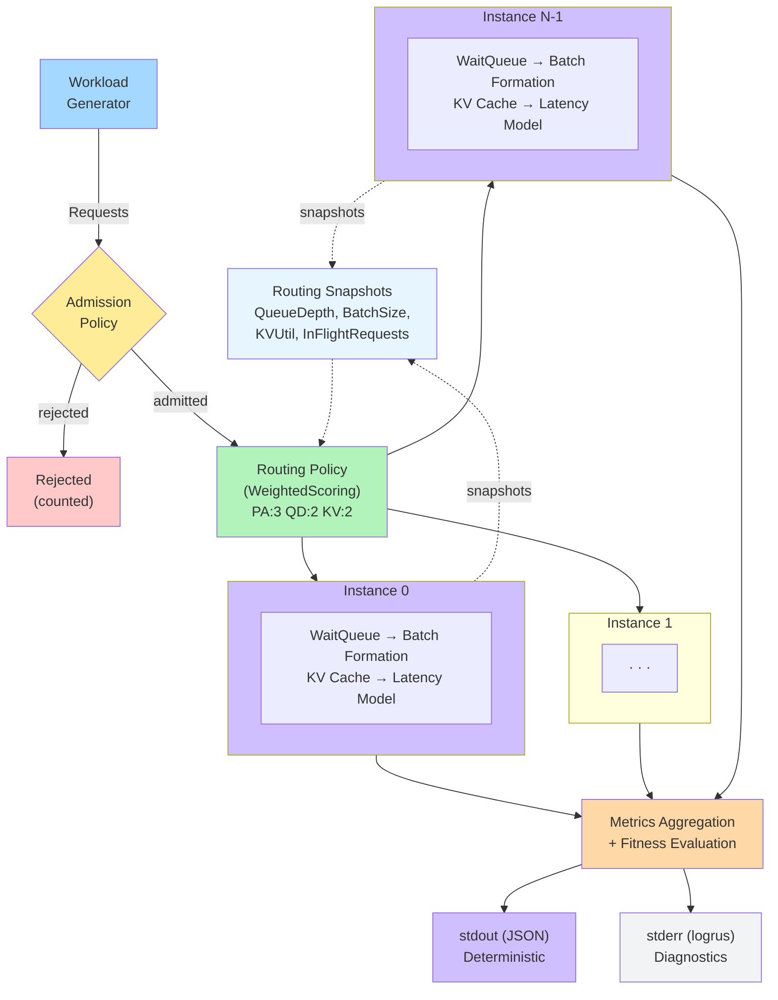
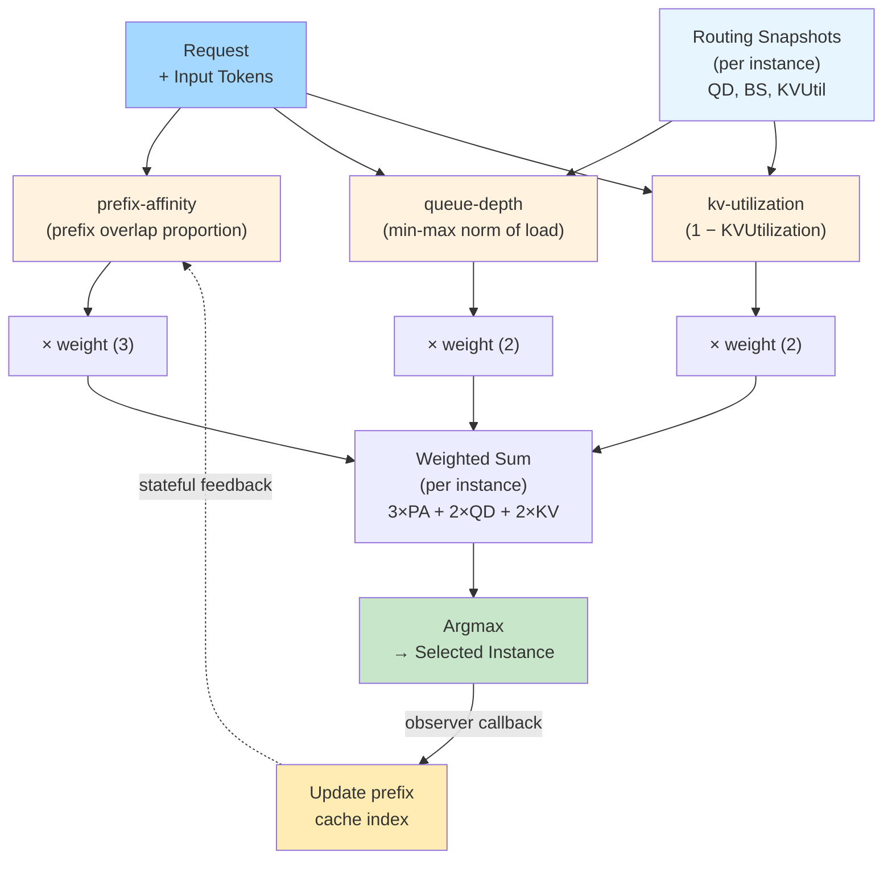
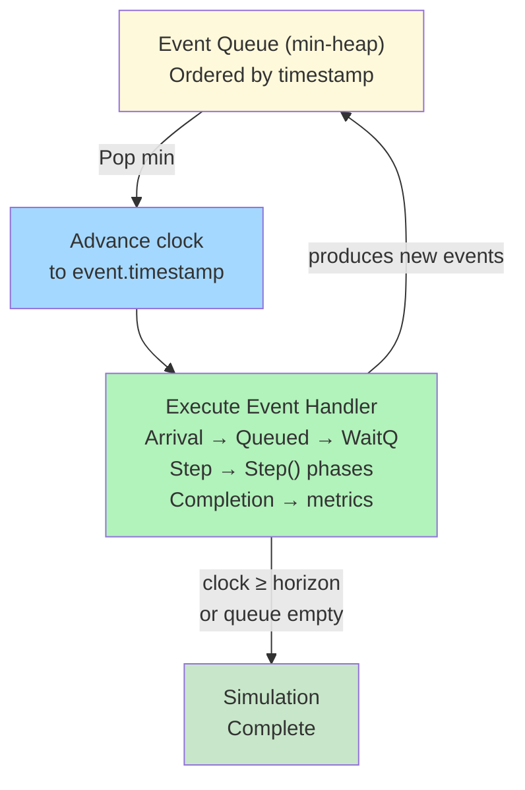
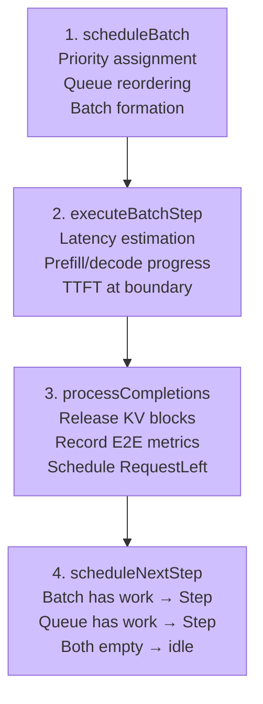
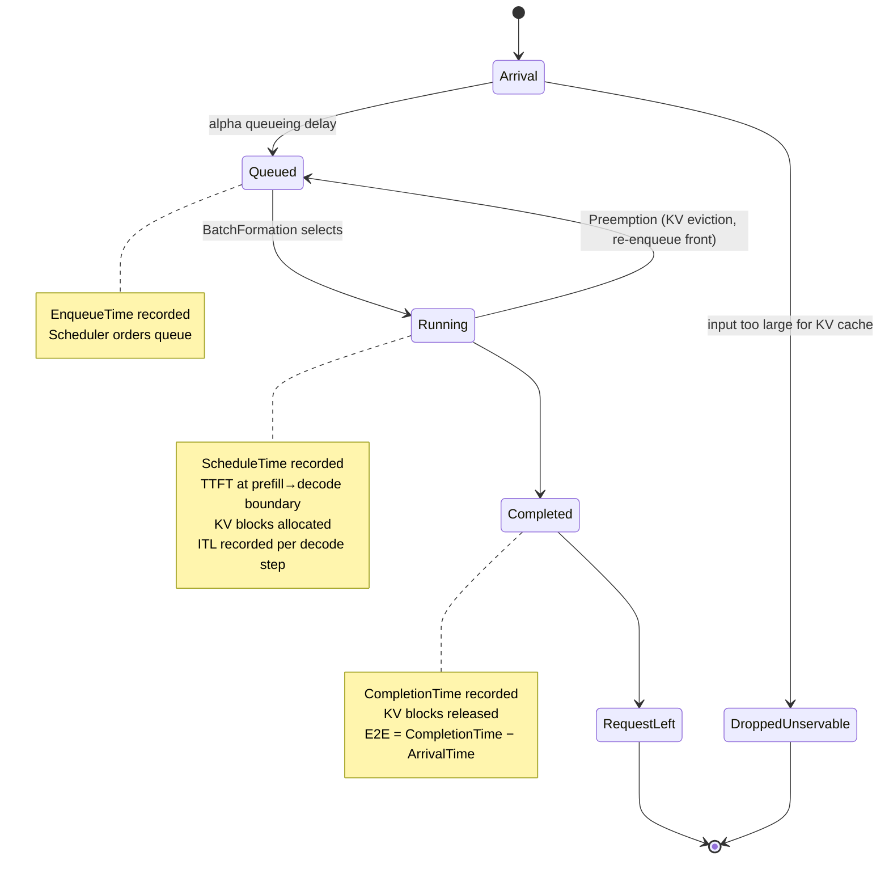
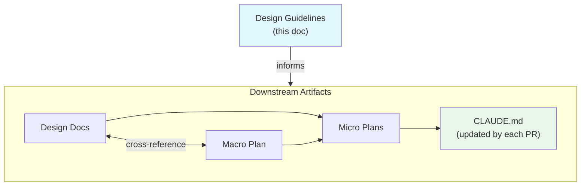
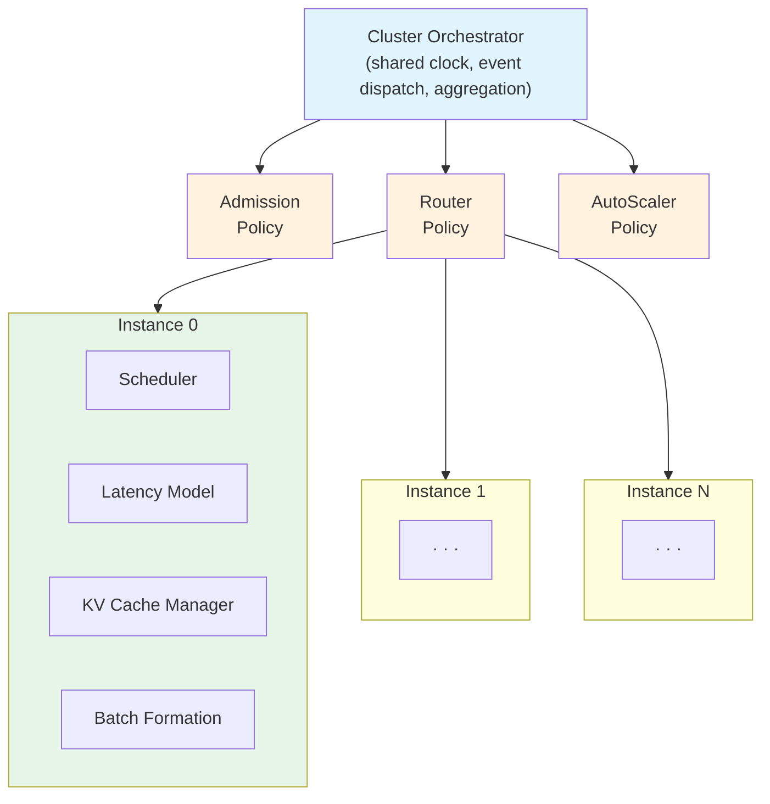
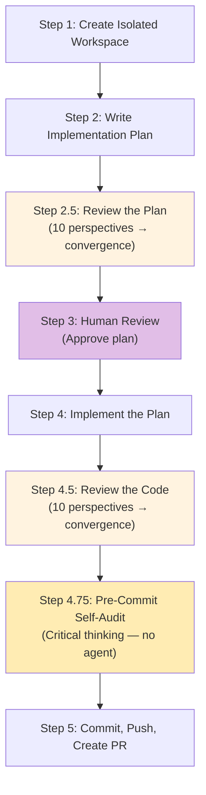
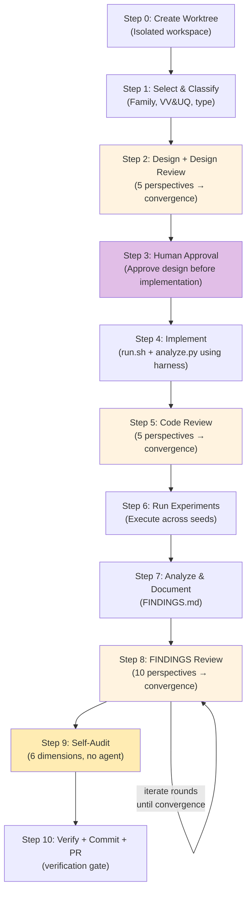

# Mermaid Diagram Migration Plan

- **Goal:** Replace all ASCII art and Excalidraw diagrams with Mermaid diagrams for diffable, maintainable, natively-rendered documentation.
- **The problem today:** Documentation uses three diagram formats (ASCII art, Excalidraw+PNG, Mermaid) inconsistently. ASCII diagrams are brittle to edit and not meaningfully diffable. Excalidraw requires an external tool and produces binary PNG files that bloat git history and can't be reviewed in PRs. Some docs have redundant dual representations (ASCII + Excalidraw PNG of the same content).
- **What this PR adds:**
  1. Converts 6 ASCII art diagrams to Mermaid `flowchart`/`stateDiagram` blocks
  2. Converts 4 Excalidraw diagrams to Mermaid equivalents, removing `.excalidraw` source and `.png` exports
  3. Establishes Mermaid as the single diagram format across all docs
- **Why this matters:** Contributors can edit diagrams in plain text, reviewers can diff diagram changes in PRs, and MkDocs renders them natively (already configured via `pymdownx.superfences`).
- **Architecture:** Docs-only change. No code changes. MkDocs config already supports Mermaid fences (mkdocs.yml lines 46-50).
- **Source:** User request to standardize on Mermaid diagrams.
- **Closes:** N/A
- **Behavioral Contracts:** See Part 1, Section B.

---

## Phase 0: Component Context

1. **Building block:** Documentation diagrams across `docs/concepts/` and `docs/contributing/`
2. **Adjacent blocks:** MkDocs rendering pipeline (already configured), GitHub markdown preview (native Mermaid support)
3. **Invariants touched:** None (docs-only)
4. **Construction site audit:** N/A (no struct changes)

---

## Part 1: Design Validation

### A) Executive Summary

This PR migrates all non-Mermaid diagrams (6 ASCII art + 4 Excalidraw) to Mermaid format. The existing Mermaid conventions from `docs/methodology/` (vertical `TD` layout, `<br/>` for multi-line labels, pastel color coding) are followed. The 4 Excalidraw source files and their 4 PNG exports are deleted. Dual-representation patterns (ASCII + PNG of same diagram) are collapsed to a single Mermaid block.

### B) Behavioral Contracts

```
BC-1: ASCII-to-Mermaid Conversion Fidelity
- GIVEN an ASCII art diagram in a markdown file
- WHEN replaced with a Mermaid diagram
- THEN the Mermaid diagram conveys the same nodes, edges, and labels as the original ASCII
- MECHANISM: Manual 1:1 conversion preserving all labeled elements

BC-2: Excalidraw-to-Mermaid Conversion Fidelity
- GIVEN an Excalidraw diagram referenced as a PNG in a markdown file
- WHEN replaced with an inline Mermaid diagram
- THEN the Mermaid diagram conveys the same visual information as the Excalidraw PNG
- MECHANISM: Parse Excalidraw JSON for element labels and connections, reproduce in Mermaid

BC-3: No Orphaned References
- GIVEN all Excalidraw PNG files are deleted
- WHEN the docs are built
- THEN no markdown file references a deleted PNG path
- MECHANISM: Remove all  image references alongside inserting Mermaid blocks

BC-4: MkDocs Build Success
- GIVEN the Mermaid fence syntax is used
- WHEN MkDocs builds the site
- THEN the build succeeds without errors
- MECHANISM: pymdownx.superfences already configured with mermaid custom fence in mkdocs.yml

BC-5: Consistent Mermaid Style
- GIVEN existing Mermaid conventions in docs/methodology/
- WHEN new Mermaid diagrams are created
- THEN they follow the same conventions: flowchart TD, <br/> line breaks, pastel fill colors
- MECHANISM: Use same style directives as strategy-evolution.md diagrams
```

### C) Component Interaction

```
Markdown files (docs/concepts/, docs/contributing/)
    ↓ contain
Mermaid fence blocks (```mermaid ... ```)
    ↓ rendered by
pymdownx.superfences (mkdocs.yml config)
    ↓ produces
HTML with Mermaid.js diagrams (MkDocs site + GitHub preview)
```

No new components. No code changes. Only markdown content and binary file deletions.

### D) Deviation Log

| Source Says | Micro Plan Does | Reason |
|-------------|-----------------|--------|
| N/A (user request, no source doc) | Follows existing Mermaid conventions from methodology docs | CONSISTENCY |

### E) Review Guide

- **Scrutinize:** Each Mermaid diagram against its original (ASCII or Excalidraw) — verify no nodes/edges lost
- **Safe to skim:** Mermaid style directives (colors, layout direction) — these follow established conventions
- **Known debt:** None

---

## Part 2: Executable Implementation

### F) Implementation Overview

**Files to modify (6):**
- `docs/concepts/architecture.md` — Replace ASCII cluster data flow + Excalidraw PNG refs (2 diagrams)
- `docs/concepts/core-engine.md` — Replace ASCII request lifecycle + Excalidraw PNG refs (2 diagrams)
- `docs/concepts/index.md` — Replace PNG thumbnail gallery with text links to diagram locations
- `docs/contributing/templates/design-guidelines.md` — Replace 2 ASCII diagrams (doc hierarchy + module map)
- `docs/contributing/pr-workflow.md` — Replace ASCII workflow overview (1 diagram)
- `docs/contributing/hypothesis.md` — Replace ASCII workflow overview (1 diagram)

**Files to delete (8):**
- `docs/concepts/diagrams/cluster-data-flow.excalidraw`
- `docs/concepts/diagrams/event-processing.excalidraw`
- `docs/concepts/diagrams/request-lifecycle.excalidraw`
- `docs/concepts/diagrams/scoring-pipeline.excalidraw`
- `docs/concepts/diagrams/clusterdataflow.png`
- `docs/concepts/diagrams/eventprocessingloop.png`
- `docs/concepts/diagrams/requestlifecycle.png`
- `docs/concepts/diagrams/scoringpipeline.png`

**Possibly delete directory:** `docs/concepts/diagrams/` if empty after deletions.

### G) Task Breakdown

#### Task 1: Convert architecture.md diagrams (BC-1, BC-2, BC-3, BC-5)

**Step 1:** Replace the ASCII cluster data flow (lines 11-31) and Excalidraw PNG reference (line 33) with a single Mermaid flowchart TD.

**Step 2:** Replace the Excalidraw scoring pipeline PNG reference (line 90) with a Mermaid flowchart showing: Request → Scorers (parallel) → Weight × Score → Sum → Argmax → Selected Instance.

**Step 3:** Verify no remaining `![` references to `diagrams/*.png` in the file.

Commit: `docs(concepts): replace ASCII+Excalidraw with Mermaid in architecture.md`

#### Task 2: Convert core-engine.md diagrams (BC-1, BC-2, BC-3, BC-5)

**Step 1:** Replace the Excalidraw event processing loop PNG reference (line 37) with two Mermaid diagrams: (3a) the event loop, and (3b) the Step() 4-phase decomposition with INV-8 annotation. **Keep the pseudocode block at lines 11-16** — it serves a concise textual purpose alongside the visual diagram.

**Step 2:** Replace the ASCII request lifecycle (lines 74-86) and Excalidraw PNG reference (line 88) with a Mermaid stateDiagram-v2 showing: Arrival → Queued → Running → Completed, with Preemption loop, DroppedUnservable branch, per-state annotations (timestamps, metrics), and INV-5 causality annotation.

**Step 3:** Verify no remaining `![` references to `diagrams/*.png` in the file.

Commit: `docs(concepts): replace ASCII+Excalidraw with Mermaid in core-engine.md`

#### Task 3: Update concepts/index.md diagram gallery (BC-3)

**Step 1:** Replace the PNG thumbnail table in the "Diagrams" section (lines 14-21) with a text-based list linking to the pages that now contain inline Mermaid diagrams. Mermaid blocks cannot render inside markdown table cells, so the gallery becomes a description list with links.

Commit: `docs(concepts): replace PNG gallery with diagram page links in index.md`

#### Task 4: Convert design-guidelines.md diagrams (BC-1, BC-5)

**Step 1:** Replace the ASCII document hierarchy (lines 25-36) with a Mermaid flowchart TD.

**Step 2:** Replace the ASCII domain module map (lines 199-227) with a Mermaid flowchart TD using subgraphs for Instance 0's internal modules.

Commit: `docs(contributing): replace ASCII with Mermaid in design-guidelines.md`

#### Task 5: Convert pr-workflow.md diagram (BC-1, BC-5)

**Step 1:** Replace the ASCII workflow overview (lines 11-50) with a Mermaid flowchart TD showing the 7-step pipeline.

Commit: `docs(contributing): replace ASCII with Mermaid in pr-workflow.md`

#### Task 6: Convert hypothesis.md diagram (BC-1, BC-5)

**Step 1:** Replace the ASCII workflow overview (lines 13-67) with a Mermaid flowchart TD showing the 11-step pipeline.

Commit: `docs(contributing): replace ASCII with Mermaid in hypothesis.md`

#### Task 7: Delete Excalidraw source files and PNG exports (BC-3)

**Step 1:** Delete all 8 files:
```bash
git rm docs/concepts/diagrams/cluster-data-flow.excalidraw
git rm docs/concepts/diagrams/event-processing.excalidraw
git rm docs/concepts/diagrams/request-lifecycle.excalidraw
git rm docs/concepts/diagrams/scoring-pipeline.excalidraw
git rm docs/concepts/diagrams/clusterdataflow.png
git rm docs/concepts/diagrams/eventprocessingloop.png
git rm docs/concepts/diagrams/requestlifecycle.png
git rm docs/concepts/diagrams/scoringpipeline.png
```

**Step 2:** Remove `docs/concepts/diagrams/` directory if empty.

**Step 3:** Grep entire docs/ for any remaining references to deleted files.

**Step 4:** Edit `CLAUDE.md` File Organization tree to remove the `diagrams/` entry (line with `│   │   └── diagrams/          # Architecture diagrams (PNG + Excalidraw source)`).

Commit: `docs: remove Excalidraw source files and PNG exports`

#### Task 8: Verify MkDocs build (BC-4)

**Step 1:** Run `mkdocs build --strict` to verify no broken references or build errors.

Commit: N/A (verification only)

### H) Test Strategy

| Contract | Task | Test Type | Verification |
|----------|------|-----------|--------------|
| BC-1 | Tasks 1-2, 4-6 | Manual | Visual comparison of Mermaid output vs original ASCII |
| BC-2 | Tasks 1-2 | Manual | Visual comparison of Mermaid output vs Excalidraw PNG |
| BC-3 | Tasks 3, 7 | Grep | `grep -r 'diagrams/' docs/` returns no PNG references |
| BC-4 | Task 8 | Build | `mkdocs build --strict` passes |
| BC-5 | Tasks 1-2, 4-6 | Manual | All new Mermaid blocks use TD layout, `<br/>`, pastel fills |

### I) Risk Analysis

| Risk | Likelihood | Impact | Mitigation |
|------|-----------|--------|------------|
| Mermaid diagram loses information from original | Low | Medium | 1:1 node/edge audit per diagram |
| MkDocs build breaks | Low | Low | mkdocs.yml already has Mermaid config; Task 7 verifies |
| GitHub preview renders differently from MkDocs | Low | Low | Both use Mermaid.js; minor style differences acceptable |

---

## Part 3: Quality Assurance

### J) Sanity Checklist

**Plan-specific checks:**
- [x] No unnecessary abstractions
- [x] No feature creep beyond PR scope
- [x] No unexercised flags or interfaces
- [x] No partial implementations
- [x] No breaking changes
- [x] CLAUDE.md update needed: remove `diagrams/` from File Organization tree

**Applicable antipattern rules:** None (docs-only PR, no Go code changes).

---

## Appendix: Mermaid Diagram Designs

### Diagram 1: Cluster Data Flow (architecture.md)



### Diagram 2: Scoring Pipeline (architecture.md)



### Diagram 3a: Event Processing Loop (core-engine.md)

Note: keep the existing pseudocode block (lines 11-16) as-is — it serves a different purpose (concise textual summary). Replace only the Excalidraw PNG with this Mermaid diagram.



### Diagram 3b: Step() 4-Phase Decomposition (core-engine.md)



> **INV-8 (Work-Conserving):** If WaitQ non-empty after step, a StepEvent MUST exist in the queue.

### Diagram 4: Request Lifecycle (core-engine.md)



> **INV-5 (Causality):** ArrivalTime ≤ EnqueueTime ≤ ScheduleTime ≤ CompletionTime

### Diagram 5: Document Hierarchy (design-guidelines.md)



### Diagram 6: Domain Module Map (design-guidelines.md)



### Diagram 7: PR Workflow Overview (pr-workflow.md)



### Diagram 8: Hypothesis Experiment Workflow (hypothesis.md)


